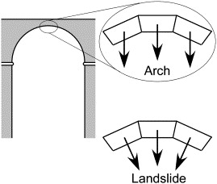

# Compiling datasets for all model training and testing

We are going to test several statistical modeling approaches for mapping landslide susceptibility on Wrangell and Mitkof Islands. All of those modeling approaches use labeled data tables containing all of the potential predictors (covariates) for both landslide points and non-landslide points to train the model. Thus, the first step to our statistical modeling is to create dataframes containing the training data.

## Topographic Numerical Covariates

The [Predictors](https://danmillerm2.github.io/Tongass_Landslides/Modeling.html) page of this report documents the topographic analysis that was performed to make raster maps of various topographic metrics that could reasonably impact landslide susceptibility. Topographic predictors generally fall into four categories:

1.  **Topographic Slope Covariates: `Grad_30`**, `FoS_72h`, `FoS_6h`

    Soils on steeper slopes experience a greater downslope pull from gravity and reduced friction (because of a weaker normal component of gravitational force). This is intuitively and practically the most important metric for prediction landslide susceptibility. We are considering 3 metrics of topographic slope: `Grad_30` - the topographic gradient (rise over run) for each pixel location (measured over a 15 m radius around the pixel); `FoS_72h` - The factor-of-safety calculation for each pixel (see [Factor-of-Safety](https://danmillerm2.github.io/Tongass_Landslides/FoS.html)) using the estimated area that contributes runoff during a 72-hour storm; and `FoS_6h` - The factor-of-safety calculation for each pixel using the estimated area that contributes runoff during a 6-hour storm. FoS metrics are not pure gradient calculations, as they consider soil properties and contributing areas, but soil properties are unknown in this analysis and treated as constant and partial contributing areas (PCAs) for different storm events are essentially an integrated measure of upslope gradient. Therefore, FoS is primarily of measure of local and upslope gradient in this study.

2.  **Contributing Area Covariates: `logaccum`**, `area_72h`, `area_6h`

    Larger contributing drainage areas can increase landslide susceptibility by increasing pore pressures and saturation levels in the soil. We consider the D8 contributing area in `logaccum` , which uses the logarithm of the drainage area. However, shallow landslides are often triggered by intense, short-duration rainfall events. In these cases, pore pressure may not be correlated with the total upstream drainage area because the timescales for rainwater to reach a potential initiation site may be significantly longer the duration of the rainfall. As described in the [Predictors page](https://danmillerm2.github.io/Tongass_Landslides/Modeling.html), we also consider `area_72h` and `area_6h`, which estimates the partial upstream area that is contributing runoff during 72-hour and 6-hour storms, respectively, assuming Darcy flow.

3.  **Topographic Curvature Covariates: `mean_curv`**, `norm_curv`, `tangential_curv`, `profile_curv`

    There are a few mechanisms by which curvature could impact slope stability. Positively curved (concave) topography should accumulate more soil than planar or convex topography if soil moves by diffusive soil creep. Soil creep tends to fill depressions and swales over time, while advective transport (fluvial erosion or landslides) tends to create concavity. Thicker soils tend to be less stable than thin soils, so concave topography that has accumulated soil should be less stable than planar or convex topography. However, if a swale has recently slid, then a concave feature might contain very little soil. Therefore, the relationship between concavity and stability is complicated by the cycle of soil accumulation and evacuation.

    To further complicate the matter, topographic concavity may also create an arching/buttressing effect that stabilizes soil (see figure below from [*Ohlmacher*, 2007](https://doi.org/10.1016/j.enggeo.2007.01.005))

    

    We consider 4 different types of concavity, all measured across a 30 m circle centered on each DEM pixel. `tangential_curv` is the curvature measured across slope (along contour lines), `profile_curv` is the curvature measure along the steepest descent path, `mean_curv` is the average of curvature measured in the north-south and east-west directions, and `norm_curv` is the \[**Dan, I can't find where you calculate norm_30 and I'm not sure what it is**\].

4.  **Aspect Covariates: `aspect`**, `northness`, `eastness`

    Slope aspect can impact stability through a variety of mechanisms: differences in evapotranspiration (impacting antecedent soil conditions), differences in vegetation, geologic fabric, etc. Aspect is generally measured as an angle (degrees or radiants) of slope orientation `aspect`. However, using angles to measure `aspect` causes a discontinuity at 0°. This can be avoided by taking the sine and cosine of the angle to describe the "`northness`" and "`eastness`" of the slope orientation.

## Non-Topographic Categorical Covariates

The LiDAR DEM provides us with several high-resolution metrics to help us model slope stability, but it does not provide any direct information about important soil properties: soil thickness, hydraulic conductivity, soil friction angle, soil cohesion, or cohesion from plant roots. Reliable estimates of these properties are rarely available in any landscape, and we do not have any maps of these properties for Wrangell or Mitkof Islands. In our factor-of-safety calculations, we assume that soil thickness, hydraulic conductivity, and soil friction angle are constant across the landscape, and that soil and root cohesion are zero. These assumptions are not true but are necessary in the absence of reliable estimates of soil properties. However, there are maps of soil classifications, lithology, and forest units, all available as polygon shapefiles. We test whether including soil, rock, and vegetation classifications improves our model predictions.

**Categorical Covariates:** `soils`, `lith`, `forest`

```{r setup, include=FALSE}
source("./functions.R")
set.seed(42)
cat_predictors <- c("lith", "soils", "forest")
```

# Island initialization

We construct one list object per island that carries all paths, parameters, and fitted model objects throughout the analysis. The raster stacks are rebuilt from disk at the start of each session via `load_rstack()` and are never saved to the state file.

The **test extent** defines the 1 km² patch used for qualitative visual assessment of model predictions. The **inset** specifies a 75 × 75 m zoom window within that patch for the inset map panels.

```{r island-construction}
mitkof <- new_island(
  name       = "Mitkof",
  raster_dir = "/Users/Jeff/Dropbox/Documents/TealWaters/Data/Tongass/mitkof_rasters/",
  shape_dir  = "/Users/Jeff/Dropbox/Documents/TealWaters/Data/Tongass/mitkof_shapefiles/",
  test_ext   = c(858699.0, 859699.0, 560185.1, 561185.1)
)
mitkof$inset <- list(
  xlim = c(859258.6, 859333.6),
  ylim = c(560588.6, 560663.6),
  loc  = "topleft",
  size = c(0.3, 0.3)
)

wrangell <- new_island(
  name       = "Wrangell",
  raster_dir = "/Users/Jeff/Dropbox/Documents/TealWaters/Data/Tongass/wrangell_rasters/",
  shape_dir  = "/Users/Jeff/Dropbox/Documents/TealWaters/Data/Tongass/wrangell_shapefiles/",
  test_ext   = c(906500, 907500, 492400, 493400)
)
wrangell$inset <- list(
  xlim = c(907262.6, 907337.6),
  ylim = c(493223.9, 493298.9),
  loc  = "bottomright",
  size = c(0.3, 0.3)
)
```

## Load raster stacks

Derived rasters (`northness`, `eastness`, `log_grad`, `ls_poly`, `flowdir`) are computed and saved on first run; subsequent calls load them directly from disk.

```{r load-rstacks}
mitkof   <- load_rstack(mitkof)
wrangell <- load_rstack(wrangell)
```

# Training data

We've written a function `sample_training_data` to create labeled training datasets for each island, consisting of all the covariates listed above for both landslide `label = 1` and non-landslide `label = 0` points. The function also allows the user to specify the number of non-landslide background points `N_bg`, selected from the potentially landslide-prone `mask` area, and the number of sample points `n_ls` for each landslide initiation polygon `ls_poly`. By default, the function randomly samples 5,000 background points and 10 sampling points per landslide polygon. By choosing the same number of sample points for each landslide, the model equally weights small and large landslides.

Coordinates for both background `label = 0` and landslide `label = 1` points are identified, and then the function extracts all covariate values for those points. We use this function to create separate training datasets for Wrangell and Mitkof Islands.

This step takes several minutes. After the first run, save the island state and reload on subsequent sessions to skip re-sampling.

```{r sample-or-load, eval=FALSE}
# --- Run once, then comment out and use the load block below ---
mitkof   <- sample_training_data(mitkof,   N_bg = 10000, n_ls = 15)
wrangell <- sample_training_data(wrangell, N_bg = 10000, n_ls = 15)

mitkof$df   <- recode_rare(mitkof$df,   cat_predictors)
wrangell$df <- recode_rare(wrangell$df, cat_predictors)

save_island(mitkof)
save_island(wrangell)
```

```{r reload-state}
# --- Load saved state (use after first run) ---
mitkof   <- readRDS(file.path(mitkof$raster_dir,   "mitkof_state.rds"))
wrangell <- readRDS(file.path(wrangell$raster_dir, "wrangell_state.rds"))
mitkof   <- load_rstack(mitkof)
wrangell <- load_rstack(wrangell)
```

# Examining training datasets

We can then examine the distribution of covariate values for both islands, separating background and landslide points.

### Quantitative Topographic Covariates

We'll first examine PDFs of the topographic covariates.

```{r fig.width=12, fig.height=15}
#| fig-cap: "Density distributions of topographic predictors for landslide
#|   (red) and background (blue) points. Distributions are shown separately
#|   for Wrangell and Mitkof."

predictors <- c("fos_72h", "fos_6h", "gradient",
                "area_72h", "area_6h", "logaccum",
                "aspect", "northness", "eastness",
                "mean_curv", "norm_curv", "tangential_curv")

wrangell$df$dataset <- "Wrangell"
mitkof$df$dataset   <- "Mitkof"
df_all <- rbind(wrangell$df, mitkof$df)
df_all$label <- factor(df_all$label, labels = c("Background", "Landslide"))
df_all <- df_all[df_all$fos_72h < 1, ]

plots <- lapply(predictors, function(pred) {
  ggplot(df_all, aes(x = .data[[pred]], fill = label)) +
    geom_density(alpha = 0.5) +
    facet_wrap(~ dataset) +
    labs(title = pred, x = NULL, y = NULL, fill = NULL) +
    theme_minimal(base_size = 16) +
    theme(legend.position = "bottom",
          plot.title = element_text(size = 16, face = "bold"))
})
wrap_plots(plots, ncol = 2) +
  plot_layout(guides = "collect") &
  theme(legend.position = "bottom")
```

Based on the separation of the distributions, it's clear that the **slope** metrics **`Grad_30`**, `FoS_72h`, `FoS_6h` consistently differentiate landslide and background terrain on both islands. **Accumulation area** `logaccum` shows distributions that nearly match for landslide and background. The partial accumulation areas show more separation. `area_6h` values are especially separated, reflecting the tendency of this covariate to depend more on upslope gradient than on the total upstream area. **Aspect** `aspect` shows separation on both islands, with Mitkof landslides concentrated around SSW slopes and Wrangell landslides concentrated on WSW slopes. **Curvature** metrics all show a subtle separation in which landslides have a slight tendency to occur in more concave parts of the landscape.

### Categorical Covariates

Next we'll make box plots of the categorical covariates. To catch just the general patterns, we'll only plot categories that include at least 10% of the data.

```{r fig.width=10, fig.height=10}
#| fig-cap: "Counts of landslide and background points by categorical predictor
#|   class. Only classes representing ≥10% of the data are retained."

cat_plots <- lapply(cat_predictors, function(pred) {
  ggplot(df_all, aes(x = .data[[pred]], fill = label)) +
    geom_bar(position = "dodge", alpha = 0.8) +
    facet_wrap(~ dataset) +
    scale_x_discrete(labels = scales::label_wrap(10)) +
    labs(title = pred, x = NULL, y = NULL, fill = NULL) +
    theme_minimal(base_size = 12) +
    theme(legend.position = "bottom",
          plot.title = element_text(size = 16, face = "bold"))
})
wrap_plots(cat_plots, ncol = 1) +
  plot_layout(guides = "collect") &
  theme(legend.position = "bottom")
```

**Lithology:** Landslides are more likely to occur in the sedimentary rocks than in the granitic rocks on both islands.

**Soils:** There are some differences in landslide frequency as a function of mapped soil units, but those are likely reflecting differences in topographic slope. Landslides are more frequent in `216F` and `233F` but those unites correspond to gravelly loam soils at 75% to 120% slope. Both `216D` and `234D` are lower-sloping soil units (35% to 75%) in sandy loam. The steep, gravelly loam soils are mapped as being thinner and better drained than the gentler-sloping sandy loams, which should make those slopes more stable. These slope classes may be capturing meaningful differences in soil thickness and drainage (hydraulic conductivity), but those variables seem to co-vary with slope, suggesting that those signals may already be embedded in the topographic metrics.

**Forest:** For the forest map, `forest = H` corresponds to hemlock forests, `forest = X` corresponds to mixed hemlock-spruce forests, and `forest = U` corresponds to undifferentiated forest units. Landslides are more frequent in hemlock-spruce forests than in other forest units.

# Setup for model evaluation

We will evaluate model performance in two ways: 1) Cross-validation with ROC curves (and AUC values) and 2) visual assessments of model predictions.

1.  For cross validation, we will sort data from both islands into `k=4` folds (groups). When evaluating model performance, we will fit the model 4 times, each time reserving a different fold from the fit so that it can be used as an independent test of model performance. We'll make 4 ROC curves and report the mean and standard deviation of the 4 AUC values for a quantitative assessment of model performance.
2.  We will also qualitatively assess model performance by making sample maps of prediction values for both Wrangell and Mitkof. These will be used to check for artifacts, noise, and generally whether the predictions look realistic. I'll

## Spatial cross-validation folds

We divide each island into 2 km hexagonal blocks and randomly assign fold numbers to each of those blocks. A list of `fold_ids` is generated to for the training dataframe from each island for model cross validation.

```{r spatial-folds}

make_folds <- function(island) {
  island_sf <- st_as_sf(island$df, coords = c("x", "y"),
                        crs = "EPSG:26931", remove = FALSE)
  sb <- cv_spatial(
    x         = island_sf,
    column    = "label",
    size      = 2000,
    k         = 4,
    selection = "random",
    iteration = 100,
    biomod2   = FALSE,
    plot      = TRUE
  )
  cv_plot(cv = sb, x = island_sf)
  sb$folds_ids
}

mitkof$fold_ids   <- make_folds(mitkof)
wrangell$fold_ids <- make_folds(wrangell)
```

## Test slice dataframes

These are the 1 km square patches that we will use to visually assess model performance. That means we will need to make landslide susceptibility estimates for every pixel in these patches (within the masked area). To do this, we will create dataframes where each row corresponds to a pixel and the columns match the columns from the training dataframes.

```{r test-dfs}
mitkof$test_df   <- recode_rare(test_df(mitkof),   cat_predictors)
wrangell$test_df <- recode_rare(test_df(wrangell), cat_predictors)

test_map(mitkof)
test_map(wrangell)
```

# Loading nodes data

For modeling runout and width, we'll rely on observed topographic properties along the centerlines of observed landslide scars. We'll load the centerline nodes that were generated with the `init_poly` Fortran code. Those node shapefiles already come with measured topographic properties for slices of the landslide polygon. The mean, maximum, and minimum values of topographic properties along those slices are collapsed to the node centerlines. The R code called here prepare_nodes adds additional columns to the node datasets:

```{r}
mitkof$nodes_df <- prepare_nodes(
  paste0(mitkof$shape_dir,"/centerNodes.shp"),
  mitkof$rstack)
save_island(mitkof)

wrangell$nodes_df <- prepare_nodes(
  paste0(wrangell$shape_dir,"/centerNodes.shp"),
  wrangell$rstack)
save_island(wrangell)
```
