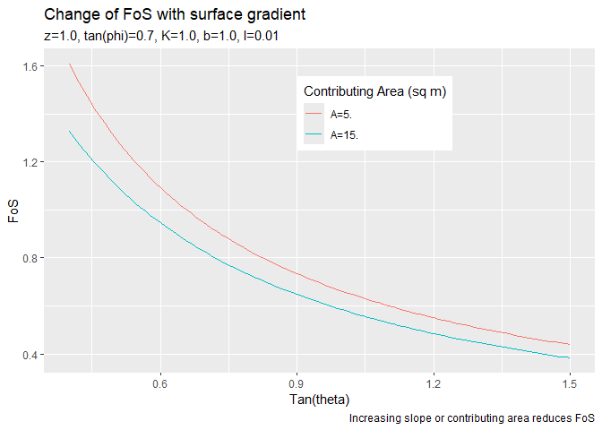
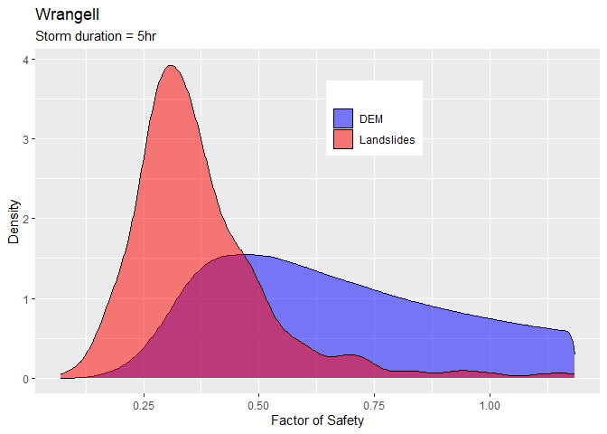

# FoS
Dan
2025-04-03

Infinite slope approximation, following (Skempton and deLory 1957). Set
what we cannot know constant.

See this
[article](https://nhsjs.com/2024/various-approaches-to-infinite-slope-stability-in-the-prediction-of-shallow-rain-induced-landslides/#google_vignette)
in the National Highschool Journal of Science for a nice description of
the infinite slope model.

We define the Factor of Safety (FoS) as the ratio of forces acting to
hold soil in place to those acting to move soil downslope. FoS values
greater than one indicate stability, less than one indicate failure. For
a cohesionless, constant-thickness, isotropic, uniform soil layer on an
infinite slope with steady-state surface-parallel saturated subsurface
flow, forces acting to hold soil in place are given by the effective
normal stress $\sigma_n'$ at the base of the soil column (i.e., the
soil-bedrock interface) multiplied by $\tan\phi$, where $\phi$ is the
friction angle of the soil. The effective stress is given by the
proportion of the weight of the soil column directed normal to the base
of the soil layer minus the pore pressure at the base. For a soil layer
of depth $z,$ the weight of a unit length and width soil column is
$\gamma_s(z\cos\theta),$ where $\gamma_s$ is the unit weight of soil
(assumed spatially uniform) and $\theta$ is the slope of the base of the
soil layer (measured from horizontal), which is assumed parallel to the
ground surface (the soil layer has uniform thickness). The portion of
that weight directed normal to the base of the soil layer is
$$\sigma_n = \gamma_s(z\cos\theta)\cos\theta.$$

For a saturated zone of vertical depth $h$ within the soil layer, with
seepage directed parallel to the surface of the ground surface, the pore
pressure $u$ at the base of the soil layer is
$$u = \gamma_w(h\cos\theta)\cos\theta.$$

The effective stress at the base of the soil layer is
$\sigma_n' = \sigma_n - u,$ so the force acting to hold soil in place
is:
$$Force\;holding\;soil\;in\;place = (\sigma_n - u)\tan\phi = \gamma_s z \cos\theta^2 - \gamma_w h \cos\theta^2.$$

We can determine the depth of saturation $h$ based on the discharge
through the soil column. That discharge is equal to the surface area of
the flow tube exiting the soil column, measured normal to the direction
of water flow, times the Darcy velocity of flow through that surface.
The flow tube defined by flow exiting the column has width $b$ as it
flows out of the column, where $b$ is the length of the contour line
(intersection of the equipotential head surface with the ground surface)
crossed by flow exiting the cell, and height $h\cos\theta$ measured
normal to the direction of water flow. The Darcy velocity of flow
through the flow tube is given by $K\sin\theta,$ where $K$ is saturated
hydraulic conductivity of the soil, assumed spatially uniform. So
discharge $q$ out of the soil column is $q = b(h\cos\theta)K\sin\theta$.
For steady-state rainfall of intensity $I,$ in depth per unit time,
discharge out of the soil column is $IA,$ where $A$ is the contributing
area (measured horizontally) for subsurface flow from infiltrating
rainfall to the soil column. From this, we can define the vertical depth
of saturation as  
$$h = \frac{IA}{bK\sin\theta\cos\theta}.
$$

The force tending to move soil downslope is given by the portion of the
soil-column weight directed parallel to the base of the soil layer
$\gamma_s (z \cos\theta) \sin\theta$. So the factor of safety (FoS) for
the soil layer is defined as

$$
FoS = \frac{(\gamma_sz\cos^2\theta - \frac{IA\gamma_w\cos^2\theta)}{Kb\sin\theta\cos\theta})\tan\phi}{\gamma_sz\sin \theta \cos\theta} = \frac{(\gamma_sz - \frac{IA\gamma_w)}{Kb\sin\theta\cos\theta})\tan\phi}{\gamma_sz\tan\theta}
$$

If we hold soil properties $\gamma_s, \gamma_w, z, \phi$, and $K$
constant, and assume steady state rainfall intensity $I$, then FoS is a
function solely of topographic attributes $b$ and $\theta$ and of the
contributing area $A$. We measure $b$ and $\theta$ from the DEM.
Contributing area is estimated as a function of storm duration, assuming
a spatially constant saturated hydraulic conductivity.

The use of a steady-state condition and infinite slope to derive these
equations is not realistic. Clearly, slopes are not planar and infinite,
soil is not uniform, and rainfall is not steady state. More realistic
models can be derived (Iverson 2000), though with more parameters the
values of which must be inferred. However, the infinite slope model has
been employed successfully as an indicator of potential instability
Dietrich, Bellugi, and Asua (2001) and, as used here, it provides a
single-valued measure of potential topographic influences on slope
stability via values of $b, \theta\,$ and $A$. This is confounded by
correlations of soil properties with topography. We may be able to
counter this to some extent by including mapped soil types in the model.
We may also experiment with topographically based models of soil depth.

Behavior of this equation over a range of slope gradients for different
values of soil properties, contributing areas, and rainfall intensities.

``` r
library(ggplot2)
library(data.table)

gamma_s <- 1.8 # unit weight of soil normalized by unit weight of water
z <- 1.0 # soil layer depth measured vertically
tanPhi <- 0.7
K <- 1.0
b <- 1.0
tantheta <- seq(from=0.4,to=1.5,length.out=100)
theta <- atan(tantheta)
costheta <- cos(theta)
sintheta <- sin(theta)

I <- 0.01
A <- 5.
u <- I*A/(K*b*sintheta*costheta)
FoS1 <- (gamma_s*z - u)*tanPhi/(gamma_s*z*tantheta)

I <- 0.01
A <- 15.
u <- I*A/(K*b*sintheta*costheta)
FoS2 <- (gamma_s*z - u)*tanPhi/(gamma_s*z*tantheta)

FoSdata <- data.table(tantheta,FoS1,FoS2)
long <- melt(FoSdata, id='tantheta')
thisplot <- ggplot(long, aes(x=tantheta, y=value)) + 
  geom_line(aes(colour=variable)) +
  labs(
    x = "Tan(theta)",
    y = "FoS",
    colour = "Contributing Area (sq m)",
    title = "Change of FoS with surface gradient",
    subtitle = "z=1.0, tan(phi)=0.7, K=1.0, b=1.0, I=0.01",
    caption = "Increasing slope or contributing area reduces FoS"
  ) +
  theme(legend.position = "inside", legend.position.inside = c(0.6, 0.8)) +
  scale_color_discrete(labels = c("A=5.", "A=15."))
plot(thisplot)
```



The plan: Run partialAccum for a range of storm durations, set hopefully
reasonable values for the variables to be held constant, and code up an
FoS routine.

``` r
library(terra)
```

    terra 1.8.5


    Attaching package: 'terra'

    The following object is masked from 'package:data.table':

        shift

``` r
# Get the FoS raster created with program PartialAccum for a 5-hour-duration storm.
FoS_pca5 <- terra::rast("c:/work/data/wrangell/fos_pca5.flt")
f <- as.data.table(FoS_pca5) 
# Get the FoS values at the inventoried initiation points
pnts <- terra::vect("c:/work/data/wrangell/LS_pnts.shp")
ls <- terra::extract(FoS_pca5,pnts)
```

    Warning: [extract] transforming vector data to the CRS of the raster

``` r
# Filter the raster FoS values to include only those less than the maximum 
# point value.
maxls <- max(ls$fos_pca5)
fsub <- subset(f, fos_pca5 <= maxls)
f1 <- as.data.table(fsub)
```

``` r
p1 <- ggplot() + 
  geom_density(data=f1, aes(x=fos_pca5, fill = 'DEM'), alpha=0.5) +
  geom_density(data=ls, aes(x=fos_pca5, fill = 'Landslides'), alpha=0.5) +
  scale_fill_manual(name = "", values = c(DEM = 'blue', Landslides = 'red')) +
  labs(
    x = "Factor of Safety",
    y = "Density",
    title = "Wrangell",
    subtitle = "Storm duration = 5hr") +
  theme(legend.position = "inside", legend.position.inside = c(0.6, 0.8))
  
p1
```



<div id="refs" class="references csl-bib-body hanging-indent"
entry-spacing="0">

<div id="ref-dietrich2001" class="csl-entry">

Dietrich, W. E., Dino Bellugi, and R. R. de Asua. 2001. “Validation of
the Shallow Landslide Model, SHALSTAB, for Forest Management.” In,
edited by M. S. Wigmosta and S. J. Burges, 195–227. Washington, D.C.:
American Geophysical Union.

</div>

<div id="ref-iverson2000a" class="csl-entry">

Iverson, Richard M. 2000. “Landslide Triggering by Rain Infiltration.”
*Water Resources Research* 36 (7): 1897–1910.
<https://doi.org/10.1029/2000wr900090>.

</div>

<div id="ref-montgomery1994" class="csl-entry">

Montgomery, David R., and William E. Dietrich. 1994. “A Physically Based
Model for the Topographic Control on Shallow Landsliding.” *Water
Resources Research* 30 (4): 1153–71.
<https://doi.org/10.1029/93wr02979>.

</div>

<div id="ref-skempton1957" class="csl-entry">

Skempton, A. W., and F. A. deLory. 1957. “Stability of Natural Slopes in
London Clay.”

</div>

</div>
