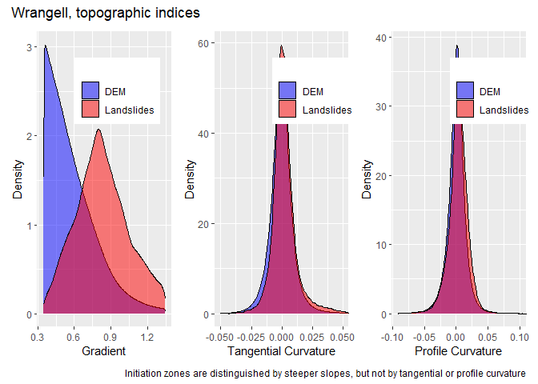
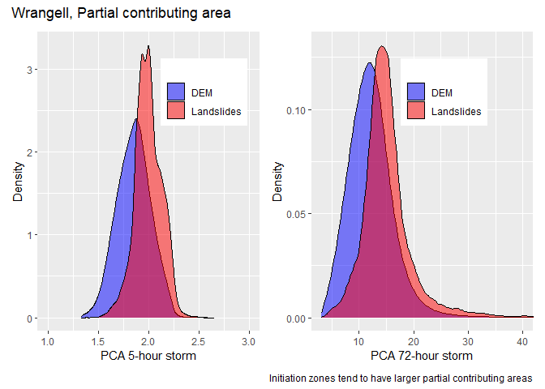
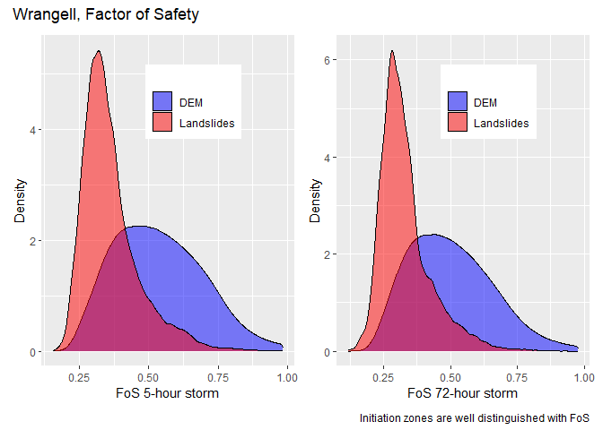
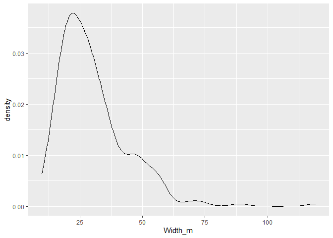

# Initiation
Dan
2025-04-03

Last access: 2025-04-03

Questions:

- How does the frequency distribution of potential predictors within
  initiation zones compare to potentially unstable terrain overall?

- Can initiation-zone geometry be related to topographic indices? For
  example, is the initiation-zone width or area related to tangential
  curvature?

Use program LS_poly.

- Filter the inventory to debris avalanches and debris flows.

- Using the “flattenWatermask” code from the DEM_module, generate center
  lines for each landslide polygon.

- Translate center lines to linked nodes.

- Build a “closest-node” raster within each polygon.

- Get mean, minimum, and maximum values of topographic indices
  associated with each node.

- Get average polygon width as area/center-line-length.

- Delineate an initiation zone with length equal to mean width.

Program LS_poly generates an output node point shapefile of centerlines.
Each node has associated attributes for horizontal distance from the top
of the polygon, upslope area, node-associated slope, tangential
curvature, and what ever else we might want to examine, e.g., a modeled
factor of safety. To delineate the likely (I hope) initiation zone, I
took the area associated with nodes within the mean polygon width of the
up-slope extent of each polygon. We can look at the distribution of
topographic-index values for these initiation zones relative to the rest
of the DEM. I’ll filter the DEM to include only index values within the
range included in the initiation zones.

I’ll start by looking at some rasters created with makegrids and
LS_init. Grad_15.flt is centered-window gradient over a radius of 7.5m
(diameter of 15m). Init.flt is a raster mask representing assumed
initiation zones generated as described above using LS_init; it has
value 1 within the initiation zone and nodata (-9999.) elsewhere.

Get the gradient within the initiation zones.

                init
               <num>
        1: 2.0276802
        2: 1.9772296
        3: 1.8767934
        4: 1.7534219
        5: 1.5707017
       ---          
    56149: 0.6181532
    56150: 0.5843589
    56151: 0.5613263
    56152: 0.5544583
    56153: 0.5748648

The topography within these zones is determined using post-landslide
lidar. Some portion of the zone may include head scarps with steeper
gradients than the pre-landslide topography. Likewise, the initiating
zone may be a subset of the mapped zone, since the boundary may expand
either during or after failure. Given these factors, it seems
appropriate to filter out the extreme low and high gradient values. I’ll
do this using Tukey’s fences.

                    grad_15
                      <num>
            1: 0.0016781257
            2: 0.0014676113
            3: 0.0008816146
            4: 0.0009484029
            5: 0.0025376051
           ---             
    142287760: 0.0019852403
    142287761: 0.0032839631
    142287762: 0.0049797115
    142287763: 0.0068473923
    142287764: 0.0075887116

I want to exclude areas where landslides do not initiate from further
analyses. I’ll create a mask based on the minimum and maximum gradient
values identified above using the inter-quartile range. All subsequent
candidate predictor rasters will be masked to include only areas within
these zones.

I’ll generate density plots comparing the entire potential zone - areas
within the gradient max-min - to the landslide initiation zones mapped
from the Tongass inventory.

Let’s look at curvatures, using the tangential and normal-profile
curvatures.

                    tan_30
                     <num>
           1: -0.001563733
           2:  0.039100818
           3: -0.112947389
           4:  0.001631375
           5:  0.070557170
          ---             
    62095960:  0.008795259
    62095961: -0.001758624
    62095962:  0.001314139
    62095963: -0.021429310
    62095964: -0.020847192

                    init
                   <num>
        1: -2.839516e-03
        2:  6.272380e-04
        3:  4.820361e-05
        4:  3.461839e-03
        5:  6.138285e-03
       ---              
    50508:  2.781242e-03
    50509:  6.140798e-05
    50510: -4.440819e-03
    50511: -9.268362e-03
    50512: -8.312606e-03

                   init
                  <num>
        1: -0.043680564
        2: -0.037604161
        3: -0.043053936
        4: -0.035328776
        5: -0.027002966
       ---             
    50508: -0.001906125
    50509: -0.002322283
    50510: -0.002556668
    50511: -0.001588161
    50512: -0.007253157

Plots:

The initiation zones appear to lie within generally steeper gradients
than the landscape within this zone, but the distribution of curvatures
appear the same. What other topographic indices might distinguish
initiation zones within the steeper terrain? Let’s try partial
contributing area, here for 5-hour and 72-hour duration storms.

               init
              <num>
        1: 2.093175
        2: 2.106313
        3: 2.110173
        4: 2.124039
        5: 2.158817
       ---         
    50508: 2.128179
    50509: 2.126740
    50510: 2.134243
    50511: 2.137588
    50512: 2.110883

               init
              <num>
        1: 14.79326
        2: 15.04397
        3: 17.40661
        4: 17.94919
        5: 18.56369
       ---         
    50508: 20.19516
    50509: 20.64870
    50510: 19.89801
    50511: 18.86460
    50512: 19.46936

There is some differentiation here, with initiation zones having
slightly higher upslope accumulation zones than the terrain in general
for both storm durations. Using a simple infinite-slope limit
equilibrium model, we can calculate an approximate factor of safety
(FoS) that incorporates effects of both slope and partial contributing
area.

                init
               <num>
        1: 0.2239085
        2: 0.2437319
        3: 0.2220742
        4: 0.2388525
        5: 0.2584022
       ---          
    50508: 0.4307395
    50509: 0.4332415
    50510: 0.4341389
    50511: 0.4271371
    50512: 0.4405518

                init
               <num>
        1: 0.2083031
        2: 0.2260092
        3: 0.1998519
        4: 0.2139148
        5: 0.2302645
       ---          
    50508: 0.3698250
    50509: 0.3695505
    50510: 0.3741286
    50511: 0.3737788
    50512: 0.3811248

How about initiation-zone size? ls_poly.f90 produces an output csv file:

There appear to be no obvious relationships between any of these
topographic indices and initiation-zone width. Next step: look for
relationships between width of the entire polygon and topographic
attributes. This will require improving alignment of the polygons. See
the example below.

The landslide polygon roughly aligns with the channel it most likely
traversed, but measures of topographic indices obtained within the
polygon will not accurately represent the topography traversed by the
landslide. Can we align the centerline of the polygon with the center of
the channel (or swale?) indicated by the topography? Not all polygons
have an obvious offset like this, so it will be a bit challenging
determining which polygons to reposition and precisely how to reposition
them.

What aspect of the topography should we examine? What length scales
should we measure those topographic attributes over? I ran program
ls_poly and output a csv file with polygon attributes.

       Min. 1st Qu.  Median    Mean 3rd Qu.    Max. 
      9.662  20.574  27.134  30.136  35.763 119.196 

Modal width is around 22 meters, the mean is around 30 m. So 30 m seems
like an appropriate length scale. Using tangential curvature as a
measure of confinement, we might therefore look for the maximum
curvature within a polygon cross section as a measure of the topographic
confinement associated with that landslide. Using the closest-node
raster within each polygon and finding the maximum tangential curvature
associated with each node, we find these relationships with mean polygon
width and polygon length:

I anticipated that smaller widths and longer lengths would be associated
with larger maximum tangential curvatures. This is roughly true for
length, but width does not appear to exhibit such a relationship.
Nevertheless, the largest widths are associated with smaller maximum
curvatures. Another option: apply a buffer around each polygon to
account for the lack of precision and misalignment of the polygon
boundaries. Create a nearest-node raster within the buffered polygon and
get mean maximum curvature for the buffered polygon.
