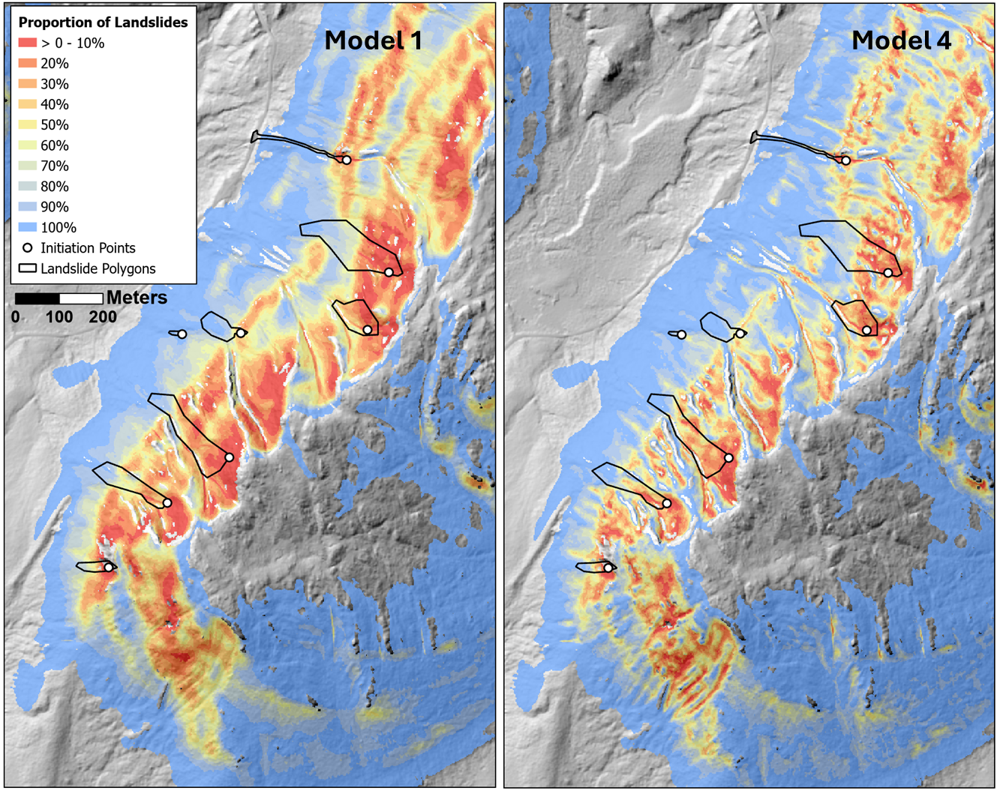

## Spatial Point Processes

In Section [Predictors](@Modeling.qmd), landslide density was calculated in terms of the area of landslide initiation zones per unit area within the masked portion of the study area. We can also calculate landslide density in terms of the number of landslides per unit area:

$$
N = \int_{A_T}\rho(s)ds \approx \sum_{i=1}^{n}a\rho_i
$$ {#eq-Ninit}

where now $N$ is the total number of landslides and $\rho(s)$ is the spatially varying density in terms of number of landslides per unit area. To the extent that each landslide occurrence is independent of any other landslide occurrence and that each landslide initiation zone can be represented by a point location on the landscape, we can view landslides as a spatial inhomogeneous [Poisson Point Process](https://en.wikipedia.org/wiki/Poisson_point_process) and utilize the methods developed for characterizing such processes [e.g., @adrianbaddeley2016a].

For a Poisson point process, the number of points found within any bounded region of space follows a Poisson distribution, for which the probability of finding $n$ points within that region is

$$
P(N=n) = \frac{\Lambda^n}{n!}e^{-\Lambda}
$$ {#eq-Poisson}

where $\Lambda$ is the expected value of $N$. That expected value is given by @eq-Ninit above: the integral of the spatially varying landslide density over the bounded region $A_T$ (the density is also referred to as the "intensity" in statistical literature). For a given spatial distribution of points, we can solve for $\rho(s)$ as a function of spatially varying covariates, e.g., as a function of the topographic indices presented above. This relationship can be expressed as an exponential function of the covariates:

$$
\rho(s) = e^{(\beta_0 + \sum_{i}\beta_iZ_i(s))}
$$ {#eq-exp_rho}

where the $\beta$s are coefficients to solve for and $Z_i(s)$ is the $i^{th}$ spatially varying covariate. Note that the *logarithm* of the density is expressed as a linear function, but the density itself as an *exponential* function.

Each landslide initiation zone must be represented now by a single point. There are several options for choosing the location of these points: the center of the initiation zone, the point manually assigned by the analysts who built the inventory, the location within the lowest stability inferred from the covariates. Because of the errors and imprecision in the spatial registration of the landslide polygons relative to the lidar DEM, I used the last option and assigned a point within each initiation zone at the DEM grid point with the lowest calculated FoS value. This biases the modeled density to lower FoS values.

The R package [spatstat](https://spatstat.org/) provides a wide array of tools for building and evaluating spatial point-process models. I use these in the examples below to characterize the relationships between $\rho(s)$ and different potential predictors and then to build and evaluate models using different combinations of these predictors.

```{r}
#| warning: false
# This code chunk sets up what is needed for spatstat.

library(data.table)
library(TerrainWorksUtils)
library(stringr)
library(ggplot2)
library(patchwork)
library(spatstat)
library(sf)
library(terra, exclude = "resample")
library(forcats)

# This function converts a spatraster (terra) to a spatstat image object
# see https://stackoverflow.com/questions/77912041/convert-raster-terra-to-im-object-spatstat
as.im.SpatRaster2 <- function(X) {
  X <- X[[1]]
  g <- as.list(X, geom=TRUE)
  
  isfact <- is.factor(X)
  if (isfact) {
    v <- matrix(as.data.frame(X)[, 1], nrow=g$nrows, ncol=g$ncols, byrow=TRUE)
  } else {
    v <- as.matrix(X, wide=TRUE)
  }
  vtype <- if(isfact) "factor" else typeof(v)
  if(vtype == "double") vtype <- "real"
  tv <- v[g$nrows:1, ]
  if(isfact) tv <- factor(tv, levels=levels(X))
  out <- list(
    v = tv,
    dim = c(g$nrows, g$ncols),
    xrange = c(g$xmin, g$xmax),
    yrange = c(g$ymin, g$ymax),
    xstep = g$xres[1],
    ystep = g$yres[1],
    xcol = g$xmin + (1:g$ncols) * g$xres[1] + 0.5 * g$xres,
    yrow = g$ymax - (g$nrows:1) * g$yres[1] + 0.5 * g$yres,
    type = vtype,
    units  = list(singular=g$units, plural=g$units, multiplier=1)
  )
  attr(out$units, "class") <- "unitname"
  attr(out, "class") <- "im"
  out
}

dataFolder <- "c:/work/data/wrangell/"

# landslide points output by program samplePoints. Each point corresponds
# to the lowest FoS72 value within each initiation zone.
landslides <- paste0(dataFolder, "initPoints.shp") |>
  st_read() |>
  st_as_sf() |>
  as.ppp() |>
  unmark()
landslides <- rescale.ppp(landslides, 1000, "km")
                                                                       
# This polygon delineates the island and serves as the study area.
wrangell <- paste0(dataFolder, "basin_stateplane.shp") |> 
  st_read() |>
  st_as_sf() |>
  as.owin()
wrangell <- rescale.owin(wrangell, 1000, "km")

# I tried generating a dense network of random points over the area
# masked by program samplePoints.exe to use as the quadrature scheme
# in spatstat. This is because using a grid for quadrature results in
# the majority of grid points falling outside of the masked area.
# Both the grid and tessellation quadrature schemes seemed to work well
# in terms of model performance when resulting density functions are
# integrated over that same scheme, but when integrated over the 2-m
# grid corresponding to that used by the covariates, the tessellation results
# do not integrate to the number of points used to train the model.
# The fit model is sensative to the quadrature scheme. I could use a grid
# quadrature scheme that matches the covariate rasters, but that is very
# slow. As seen below, I used a quadrature grid that samples the covariate
# values over a 10-m spacing. 
#outpnts <- "c:/work/data/wrangell/outpoints.shp" |>
#  st_read() |>
#  st_as_sf() |>
#  as.ppp() |> 
#  unmark()
#outpnts <- rescale.ppp(outpnts, 1000, "km")

# List of predictor rasters, single precision real
# Each row has the following items:
# Name, file, lower cutoff, upper cutoff, MASK, SELECT
# If "MASK" is present, the raster is used to generate a mask that 
# limits the spatial extent of the analysis to include only raster
# values within the range found within initiation zones. If "SELECT" is
# present, the raster is used to identify the sample points used for 
# Poisson spatial point processes.

rasterList <- read.csv(paste0(dataFolder, "R4rasterList.csv"), )
R4rasters <- vector("list",nrow(rasterList)-1)

for (i in 1:nrow(rasterList)) {

  if (str_detect(rasterList[i,1], "MASK")) {
    outMask <- trimws(rasterList[i,2])
  } else {
    r <- vector("list", 6)
    for (j in 1:6) {
      r[[j]] <- trimws(rasterList[i,j])
    }
    R4rasters[[i]] <- r
  }
}

for (i in 1:length(R4rasters)) {
  r <- terra::rast(paste0(R4rasters[[i]][2],".flt"))
  names(r) <- R4rasters[[i]][1]
  if (i == 1) {
    rstack <- r
  } else {
    rstack <- c(rstack, r)
  }
}

rasterList <- read.csv(paste0(dataFolder, "I4rasterList.csv"))
I4rasters <- vector("list", nrow(rasterList))

for (i in 1:nrow(rasterList)) {
  r <- vector("list",3)
  r[[1]] <- trimws(rasterList[i,1])
  r[[2]] <- trimws(rasterList[i,2])
  r[[3]] <- trimws(rasterList[i,3])
  I4rasters[[i]] <- r
}


FoS <- as.im.SpatRaster2(rstack[[3]])
FoS <- rescale.im(FoS, 1000, "km")
aspect <- as.im.SpatRaster2(rstack[[9]])
aspect <- rescale.im(aspect, 1000, "km")
tan <- as.im.SpatRaster2(rstack[[6]])
tan <- rescale.im(tan, 1000, "km")
prof <- as.im.SpatRaster2(rstack[[7]])
prof <- rescale.im(prof, 1000, "km")
accum <- as.im.SpatRaster2(rstack[[10]])
accum <- rescale.im(accum, 1000, "km")
mask <- terra::rast(paste0(outMask, ".flt"))
mask_im <- as.im.SpatRaster2(mask)
mask_im <- rescale.im(mask_im, 1000, "km")

# outpoints was generated by samplePoints in a previous code chunk
#quadpnts <- quadscheme(landslides, dummy=outpnts, method="dirichlet")

```

```{r}
# This is the better performing quadrature scheme.
quadgrid <- quadscheme(landslides, method="grid", eps=0.01) # eps=0.01, 10-meters
```

With @eq-exp_rho above, the logarithm of landslide density is described as a linear function of the covariates. However, that relationship may not be linear, as was seen with the density plots in Section [Predictors](Modeling.qmd).. Such nonlinear relationships can be characterized in a linear-equation framework by using polynomials of the covariate value or generalized additive models (GAMs) in which the relationship is characterized using splines. In the following code chunk, a Poisson Point Model is fit to each candidate coefficient using polynomials of first through fourth order. The degree to which each polynomial matches the relationship with density - the goodness of fit - is gauged using [partial residual plots](https://en.wikipedia.org/wiki/Partial_residual_plot).

```{r}
#| warning: false
# Examine goodness of fit.
# 
fit_fos <- ppm(quadgrid ~ FoS, subset = mask_im)
pr_fos <- parres(fit_fos, "FoS")
fit_tan <- ppm(quadgrid ~ tan, subset = mask_im)
pr_tan <- parres(fit_tan, "tan")
fit_prof <- ppm(quadgrid ~ prof, subset = mask_im)
pr_prof <- parres(fit_prof, "prof")
fit_aspect <- ppm(quadgrid ~ aspect, subset = mask_im)
pr_aspect <- parres(fit_aspect, "aspect")

fit_tan2 <- ppm(quadgrid ~ polynom(tan,2), subset = mask_im) 
pr_tan2 <- parres(fit_tan2, "tan")
fit_prof2 <- ppm(quadgrid ~ polynom(prof,2), subset = mask_im) 
pr_prof2 <- parres(fit_prof2, "prof")
fit_aspect2 <- ppm(quadgrid ~ polynom(aspect,2), subset = mask_im)
pr_aspect2 <- parres(fit_aspect2, "aspect")

fit_tan3 <- ppm(quadgrid ~ polynom(tan,3), subset = mask_im) 
pr_tan3 <- parres(fit_tan3, "tan")
fit_prof3 <- ppm(quadgrid ~ polynom(prof,3), subset = mask_im)
pr_prof3 <- parres(fit_prof3, "prof")
fit_aspect3 <- ppm(quadgrid ~ polynom(aspect,3), subset = mask_im)
pr_aspect3<- parres(fit_aspect3, "aspect")

fit_tan4 <- ppm(quadgrid ~ polynom(tan,4), subset = mask_im) # best
pr_tan4 <- parres(fit_tan4, "tan")
fit_prof4 <- ppm(quadgrid ~ polynom(prof,4), subset = mask_im) # best
pr_prof4 <- parres(fit_prof4, "prof")
fit_aspect4 <- ppm(quadgrid ~ polynom(aspect,4), subset = mask_im)
pr_aspect4 <- parres(fit_aspect4, "aspect")

fit_aspect5 <- ppm(quadgrid ~ polynom(aspect,5), subset = mask_im) # best
pr_aspect5 <- parres(fit_aspect5, "aspect")
```

The partial residual plots (which I havent' shown, but you can see if you are running this in RStudio) suggest how to best characterize each covariate. The flow accumulation does not fit well with any choice and I exclude it from further analysis. The next code chunk builds a series of models with increasing combinations of the covariates.

```{r}
fit1 <- ppm(quadgrid ~ FoS, subset = mask_im)
fit2a <- ppm(quadgrid ~ FoS + polynom(prof,4), subset = mask_im)
fit2b <- ppm(quadgrid ~ FoS + polynom(tan,4),  subset = mask_im)
fit2c <- ppm(quadgrid ~ FoS + polynom(aspect,5), subset = mask_im)
fit3a <- ppm(quadgrid ~ FoS + polynom(tan,4) + polynom(prof,4), subset = mask_im)
fit3b <- ppm(quadgrid ~ FoS + polynom(prof,4) + polynom(aspect,5), subset = mask_im)
fit3c <- ppm(quadgrid ~ FoS + polynom(tan,4) + polynom(aspect,5), subset = mask_im)
fit4 <- ppm(quadgrid ~ FoS + polynom(tan,4) + polynom(prof,4) + polynom(aspect,5), subset = mask_im)
```

We can use the ROC curves and AUC values to look at how well each of these models differentiates the locations of the initiation points from the total area. The Fortran program modelDensity takes the coefficients of each of these models, builds a density raster, assembles ROC curves using the density raster and initiation points, and calculates the AUC value for each curve. These are shown in @fig-modROC below

```{r}
#| echo: false

outMask <- paste0(outMask, ".flt")
outInitPoints <- paste0(dataFolder, "initPoints")
coefs <- fit1$coef
intercept <- coefs[[1]]
c1 <- c("FoS", R4rasters[[3]][[2]], 1, coefs[[2]])
rastersR4 <- list(c1)
rastersI4 <- vector(mode = "list", length = 0)
unit = "KM"
prop_raster <- paste0(dataFolder, "prop_1")
density_raster <- paste0(dataFolder, "density_1")
ROC <- paste0(dataFolder, "ROC_1")
scratchDir <- "c:/work/scratch"
executable_dir <- "c:/work/sandbox/gridutilities/projects/modelDensity/x64/release/"

returnCode <- TerrainWorksUtils::modelDensity(
  outMask,
  outInitPoints,
  intercept,
  rastersR4,
  rastersI4,
  unit,
  prop_raster,
  density_raster,
  ROC,
  scratchDir,
  executable_dir)

if (returnCode != 0) {
  stop("modelDensity failed for fit1")
}

coefs <- fit2a$coef
intercept <- coefs[[1]]
c1 <- c("FoS", R4rasters[[3]][[2]], 1, coefs[[2]])
c2 <- c("Prof", R4rasters[[7]][[2]], 4, coefs[[3]], coefs[[4]], coefs[[5]], coefs[[6]])
rastersR4 <- list(c1, c2)
prop_raster <- paste0(dataFolder, "prop_2a")
density_raster <- paste0(dataFolder, "density_2a")
ROC <- paste0(dataFolder, "ROC_2a")

returnCode <- TerrainWorksUtils::modelDensity(
  outMask,
  outInitPoints,
  intercept,
  rastersR4,
  rastersI4,
  unit,
  prop_raster,
  density_raster,
  ROC,
  scratchDir,
  executable_dir)

if (returnCode != 0) {
  stop("modelDensity failed for fit2a")
}

coefs <- fit2b$coef
intercept <- coefs[[1]]
c1 <- c("FoS", R4rasters[[3]][[2]], 1, coefs[[2]])
c2 <- c("Tan", R4rasters[[6]][[2]], 4, coefs[[3]], coefs[[4]], coefs[[5]], coefs[[6]])
rastersR4 <- list(c1, c2)
prop_raster <- paste0(dataFolder, "prop_2b")
density_raster <- paste0(dataFolder, "density_2b")
ROC <- paste0(dataFolder, "ROC_2b")

returnCode <- TerrainWorksUtils::modelDensity(
  outMask,
  outInitPoints,
  intercept,
  rastersR4,
  rastersI4,
  unit,
  prop_raster,
  density_raster,
  ROC,
  scratchDir,
  executable_dir)

if (returnCode != 0) {
  stop("modelDensity failed for fit2b")
}

coefs <- fit2c$coef
intercept <- coefs[[1]]
c1 <- c("FoS", R4rasters[[3]][[2]], 1, coefs[[2]])
c2 <- c("Aspect", R4rasters[[9]][[2]], 5, coefs[[3]], coefs[[4]], coefs[[5]], coefs[[6]], coefs[[7]])
rastersR4 <- list(c1, c2)
prop_raster <- paste0(dataFolder, "prop_2c")
density_raster <- paste0(dataFolder, "density_2c")
ROC <- paste0(dataFolder, "ROC_2c")

returnCode <- TerrainWorksUtils::modelDensity(
  outMask,
  outInitPoints,
  intercept,
  rastersR4,
  rastersI4,
  unit,
  prop_raster,
  density_raster,
  ROC,
  scratchDir,
  executable_dir)

if (returnCode != 0) {
  stop("modelDensity failed for fit2c")
}

coefs <- fit3a$coef
intercept <- coefs[[1]]
c1 <- c("FoS", R4rasters[[3]][[2]], 1, coefs[[2]])
c2 <- c("Tan", R4rasters[[6]][[2]], 4, coefs[[3]], coefs[[4]], coefs[[5]], coefs[[6]])
c3 <- c("Prof", R4rasters[[7]][[2]], 4, coefs[[7]], coefs[[8]], coefs[[9]], coefs[[10]])
rastersR4 <- list(c1, c2, c3)
prop_raster <- paste0(dataFolder, "prop_3a")
density_raster <- paste0(dataFolder, "density_3a")
ROC <- paste0(dataFolder, "ROC_3a")

returnCode <- TerrainWorksUtils::modelDensity(
  outMask,
  outInitPoints,
  intercept,
  rastersR4,
  rastersI4,
  unit,
  prop_raster,
  density_raster,
  ROC,
  scratchDir,
  executable_dir)

if (returnCode != 0) {
  stop("modelDensity failed for fit3a")
}

coefs <- fit3b$coef
intercept <- coefs[[1]]
c1 <- c("FoS", R4rasters[[3]][[2]], 1, coefs[[2]])
c2 <- c("Prof", R4rasters[[7]][[2]], 4, coefs[[3]], coefs[[4]], coefs[[5]], coefs[[6]])
c3 <- c("Aspect", R4rasters[[9]][[2]], 5, coefs[[7]], coefs[[8]], coefs[[9]], coefs[[10]], coefs[[11]])
rastersR4 <- list(c1, c2, c3)
prop_raster <- paste0(dataFolder, "prop_3b")
density_raster <- paste0(dataFolder, "density_3b")
ROC <- paste0(dataFolder, "ROC_3b")

returnCode <- TerrainWorksUtils::modelDensity(
  outMask,
  outInitPoints,
  intercept,
  rastersR4,
  rastersI4,
  unit,
  prop_raster,
  density_raster,
  ROC,
  scratchDir,
  executable_dir)

if (returnCode != 0) {
  stop("modelDensity failed for fit3b")
}

coefs <- fit3c$coef
intercept <- coefs[[1]]
c1 <- c("FoS", R4rasters[[3]][[2]], 1, coefs[[2]])
c2 <- c("Tan", R4rasters[[6]][[2]], 4, coefs[[3]], coefs[[4]], coefs[[5]], coefs[[6]])
c3 <- c("Aspect", R4rasters[[9]][[2]], 5, coefs[[7]], coefs[[8]], coefs[[9]], coefs[[10]], coefs[[11]])
rastersR4 <- list(c1, c2, c3)
prop_raster <- paste0(dataFolder, "prop_3c")
density_raster <- paste0(dataFolder, "density_3c")
ROC <- paste0(dataFolder, "ROC_3c")

returnCode <- TerrainWorksUtils::modelDensity(
  outMask,
  outInitPoints,
  intercept,
  rastersR4,
  rastersI4,
  unit,
  prop_raster,
  density_raster,
  ROC,
  scratchDir,
  executable_dir)

if (returnCode != 0) {
  stop("modelDensity failed for fit3c")
}

coefs <- fit4$coef
intercept <- coefs[[1]]
c1 <- c("FoS", R4rasters[[3]][[2]], 1, coefs[[2]])
c2 <- c("Tan", R4rasters[[6]][[2]], 4, coefs[[3]], coefs[[4]], coefs[[5]], coefs[[6]])
c3 <- c("Prof", R4rasters[[7]][[2]], 4, coefs[[7]], coefs[[8]], coefs[[9]], coefs[[10]])
c4 <- c("Aspect", R4rasters[[9]][[2]], 5, coefs[[11]], coefs[[12]], coefs[[13]], coefs[[14]], coefs[[15]])
rastersR4 <- list(c1, c2, c3, c4)
prop_raster <- paste0(dataFolder, "prop_4")
density_raster <- paste0(dataFolder, "density_4")
ROC <- paste0(dataFolder, "ROC_4")

returnCode <- TerrainWorksUtils::modelDensity(
  outMask,
  outInitPoints,
  intercept,
  rastersR4,
  rastersI4,
  unit,
  prop_raster,
  density_raster,
  ROC,
  scratchDir,
  executable_dir)

if (returnCode != 0) {
  stop("modelDensity failed for fit4")
}
```

```{r}

thisAUC <- function(thisROC) {
  thisAUC <- 0
  for (i in 2:nrow(thisROC)) {
    dx <- thisROC[i,5] - thisROC[i-1,5]
    dy <- (thisROC[i-1,6] + thisROC[i,6])*0.5
    thisAUC <- thisAUC + dx*dy
  }
  return(thisAUC)
}

rm(auc)
rm(roc_dt)
auc_dt <- data.table(name=character(), val=numeric())
roc_dt <- data.table(name=character(), FPR=numeric(), TPR=numeric())

models <- c("1", "2a", "2b", "2c", "3a", "3b", "3c", "4")
lineplot <- vector(mode = "list", length = length(models))
lineslope <- data.table(model=character(),slope=numeric())
for (i in 1:length(models)) {
  thisROC <- as.data.table(read.csv(paste0(dataFolder, "ROC_", models[[i]],".csv")))
  AUC <- thisAUC(thisROC)
  ROCs <- thisROC[, .(name=models[[i]], FPR, TPR)]
  roc_dt <- rbind(roc_dt, ROCs[,])
  auc_dt <- rbind(auc_dt, list(models[[i]],AUC[[1]]))
  maxin <- max(thisROC$Sum_in)
  lineplot[[i]] <- ggplot(thisROC, aes(x=Sum_in, y=Sum_out)) +
    geom_point(shape=1, size=2, stroke=.5, color='black', alpha=0.4) +
    geom_segment(x=0,y=0,xend=maxin,yend=maxin,linewidth=0.8,color='black') +
    labs(title=paste0("Model ",models[[i]]),
         x = 'Landslides',
         y = 'Integral') +
    theme(plot.title = element_text(hjust = 0.1, vjust=-10)) +
    coord_cartesian(x=c(0,212),y=c(0,212))
  
  lmod <- lm(Sum_out ~ Sum_in-1, data=thisROC)
  slope <- lmod$coef[[1]]
  lineslope <- rbind(lineslope, list(models[[i]], slope))
}

```

```{r}
#| label: fig-modROC

roc_dt <- roc_dt[, name := factor(name)]
rocplot <- ggplot(roc_dt, aes(x=FPR, y=TPR, color=name)) + 
  geom_line() +
  theme(
    legend.position = "inside",
    legend.position.inside = c(.8,.4)) +
  labs(color="Model",
       title="ROC curves")

auc_dt <- auc_dt[, name := factor(name)]
aucplot <- ggplot(auc_dt, aes(x=fct_reorder(name,val),y=val)) + 
  geom_col(fill="lightgray", color="black") +
  coord_cartesian(y=c(0.91,0.922)) +
  labs(title="AUC for each model",
       x = "Model",
       y = "Area Under the Curve")

p1 <- rocplot + aucplot
plot(p1)
```

The Factor of Safety (FoS) is the primary covariate that discriminates initiation points. The other covariates add some, but very little additional discriminating power: the ROC curves are nearly indistinguishable and the maximum increase in AUC is only 0.01.

Recall that the integral of density over area gives the expected number of landslide points within the study area. Performing the integral as the sum of density values for each DEM cell, with density ordered from smallest to largest (or visa versa) gives the expected number of landslides as a function of density. The observed landslide points each have an associated density value (that of the DEM cell they are located in), so these can also be ordered by density. For a well-performing model, a plot of the number of expected landslides (the sum of ordered density values) versus the actual number should fall along a diagonal line with a slope of 1. Such a plot for each model is shown in @fig-lines.

```{r}
#| label: fig-lines

p1 <- lineplot[[1]] / lineplot[[3]] / lineplot[[5]] / lineplot[[7]] + plot_layout(axes="collect") 
p2 <- lineplot[[2]] / lineplot[[4]] / lineplot[[6]] / lineplot[[8]]  & theme(axis.title.y = element_blank(), axis.text.y = element_blank(),
 axis.ticks.y = element_blank())
thisplot <- p1 | p2 + plot_layout(axes = "collect")
plot(thisplot)
```

The closer the slope of the plotted line (actual versus modeled) is to one, the better the modeled density values represent the spatial distribution of landslide points. The slope for each model is shown in @fig-slope.

```{r}
#| label: fig-slope

lineslope <- lineslope[, model := factor(model)]
p1 <- ggplot(data=lineslope, aes(x=fct_reorder(model,slope),y=slope)) +
  geom_col(fill='lightgray', color='black') +
  coord_cartesian(ylim=c(.85,1.)) +
  labs(title='Slope of the actual to modeled number of landslides',
       subtitle = 'Bigger is better, the best model would have a slope of one',
       x = 'Model',
       y = 'Slope') +
  theme(plot.title = element_text(hjust = 0.1, vjust=-15),
        plot.subtitle = element_text(hjust = 0.1, vjust=-18))
plot(p1)
```

So far, we've looked at landslide density in terms of the number of landslides. We can also examine model results in terms of the proportion of all landslides expected within any portion of the study area. Taking all modeled density values for each pixel in the density raster, ordering these from largest to smallest, generating a cumulative sum, and then dividing by the total sum, each pixel is assigned a value indicating the proportion of the total number of modeled landslides found in areas with smaller modeled density values. We can then divide the landscape into zones expected to contain a specified proportion of all landslides, ordered from highest density to lowest. @fig-maps shows images for a small portion of the study area with the landscape divided into zones each containing 10% of the modeled landslides. These zones are ordered so that the 0-10% bin contains the highest landslide density and the 90-100% bin contains the lowest density.

{#fig-maps}

Model 1 used only the FoS (Factor of Safety). Model 4 used four covariates: FoS, tangential curvature, profile curvature, and aspect. Zones of modeled highest landslide density are more focused with Model 4. With all the models, the proportion of the (masked) study area encompassed within each 10% bin is small for the high-density portions and very large for the low-density portions. This is shown for Models 1 and 4 in the left panel of @fig-propArea below. For both models, the first bin (0-10%) entails less than 1% of the study area, whereas the vast proportion of the study area (\>70%) is contained in the last bin. The right panel shows the average landslide density within each 10% zone.

```{r}
#| label: fig-propArea

area1 <- as.data.table(read.csv(paste0(dataFolder,"ROC_1_area.csv")))
area1 <- area1[, Model := "Model 1"]
area4 <- as.data.table(read.csv(paste0(dataFolder, "ROC_4_area.csv")))
area4 <- area4[, Model := "Model 4"]
area1 <- rbind(area1, area4)

p1 <- ggplot(area1, aes(x=Proportion.Landslides,y=Proportion.Area,color=Model)) +
  geom_point(shape=1,size=4,stroke=1.3) +
  geom_line(linewidth=1) +
  scale_y_log10() +
  scale_x_continuous(breaks=seq(0,1,by=0.1), labels = scales::percent) +
  theme(legend.position = "inside",
        legend.position.inside = c(.3, .7),
        legend.title = element_blank()) +
  labs(x = 'Landslide Bin',
       y = 'Proportion of masked study area in each bin')

area1 <- area1[, density := 0.1/Proportion.Area]
p2 <- ggplot(area1, aes(x=Proportion.Landslides,y=density,color=Model)) +
  geom_point(shape=1,size=4,stroke=1.3) +
  geom_line(linewidth=1) +
  scale_x_continuous(breaks=seq(0,1,by=0.1), labels = scales::percent) +
  theme(legend.position = "inside",
        legend.position.inside = c(.7,.7),
        legend.title = element_blank()) +
  labs(x = "Landslide Bin",
       y = "Landslide Density (#/sq km)")

p = p1 + p2
plot(p)
```

If the models do a good job of distinguishing spatial variations in landslide density, then we should find an equal number of mapped landslide points in each bin. The number in each bin for each model is shown in @fig-bins. Ideally, every bin should contain just about 21 landslides (10% of 211). The result is constrained by the degree to which the exponential equation of the covariates (@eq-exp_rho) can produce a spatial distribution of landslide density that, when integrated over the study area, matches the spatial distribution of mapped landslide initiation points. The smaller the variability in landslide numbers within each bin, the better the model is at distinguishing spatial variability in landslide density. The standard deviation of these numbers is shown in @fig-sd.

A lower standard deviation suggests a better model, to a certain degree. The landslide inventory is a sample of all possible landslides and will probably not provide a complete picture of where landslides could occur. It may be biased by certain storm events in the period over which the inventory was collected and may exhibit random clustering of landslides in particular zones. Bias and noise in landslide data influence the spatial distribution of density calculated with a model. Future landslides may exhibit different biases and different random variations in location, so a model that fits previously observed patterns very closely may not work as well for predicting future patterns. We will explore this issue more when looking at model validation, but for now, note that, to the degree to which landslide initiation locations can be represented as Poisson point patterns, the number of landslides expected in each modeled zone will vary as described with @eq-Poisson. The 90% confidence intervals for a Poisson distribution are also shown in @fig-bins.

```{r}
#| fig-height: 7
#| label: fig-bins
prop_dt <- as.data.table(read.csv(paste0(dataFolder, "prop_1.csv")))
prop_dt <- prop_dt[, .(Proportion, "Model_1" = Number.of.points)]
p <- as.data.table(read.csv(paste0(dataFolder, "prop_2a.csv")))
prop_dt <- prop_dt[, "Model_2a" := p[,Number.of.points]]
p <- as.data.table(read.csv(paste0(dataFolder, "prop_2b.csv")))
prop_dt <- prop_dt[, "Model_2b" := p[,Number.of.points]]
p <- as.data.table(read.csv(paste0(dataFolder, "prop_2c.csv")))
prop_dt <- prop_dt[, "Model_2c" := p[,Number.of.points]]
p <- as.data.table(read.csv(paste0(dataFolder, "prop_3a.csv")))
prop_dt <- prop_dt[, "Model_3a" := p[,Number.of.points]]
p <- as.data.table(read.csv(paste0(dataFolder, "prop_3b.csv")))
prop_dt <- prop_dt[, "Model_3b" := p[,Number.of.points]]
p <- as.data.table(read.csv(paste0(dataFolder, "prop_3c.csv")))
prop_dt <- prop_dt[, "Model_3c" := p[,Number.of.points]]
p <- as.data.table(read.csv(paste0(dataFolder, "prop_4.csv")))
prop_dt <- prop_dt[, "Model_4" := p[,Number.of.points]]

p1 <- ggplot(prop_dt, aes(x=Proportion,y=Model_1)) + 
  geom_segment(x=0, y=13, xend=1, yend=13, color="gray", linewidth=2) +
  geom_segment(x=0, y=29, xend=1, yend=29, color="gray", linewidth=2) +
  geom_point(shape=1, size=3, stroke=1.2) +
  geom_line(linewidth=1) +
  scale_x_continuous(breaks = seq(0, 1, by=0.1), labels = scales::percent) +
  theme(plot.title = element_text(hjust = 0.8, vjust=-10)) +
  coord_cartesian(y=c(10,40)) +
  labs(title='Model 1',
       x = 'Proportion',
       y = 'Number of points') 
p2a <- ggplot(prop_dt, aes(x=Proportion,y=Model_2a)) + 
  geom_segment(x=0, y=13, xend=1, yend=13, color="gray", linewidth=2) +
  geom_segment(x=0, y=29, xend=1, yend=29, color="gray", linewidth=2) +
  geom_point(shape=1, size=3, stroke=1.2) +
  geom_line(linewidth=1) +
  scale_x_continuous(breaks = seq(0, 1, by=0.1), labels = scales::percent) +
  theme(plot.title = element_text(hjust = 0.8, vjust=-10)) +
  coord_cartesian(y=c(10,40)) +
  labs(title='Model 2a',
       x = 'Proportion',
       y = 'Number of points') 
p2b <- ggplot(prop_dt, aes(x=Proportion,y=Model_2b)) + 
  geom_segment(x=0, y=13, xend=1, yend=13, color="gray", linewidth=2) +
  geom_segment(x=0, y=29, xend=1, yend=29, color="gray", linewidth=2) +  
  geom_point(shape=1, size=3, stroke=1.2) +
  geom_line(linewidth=1) +
  scale_x_continuous(breaks = seq(0, 1, by=0.1), labels = scales::percent) +
  theme(plot.title = element_text(hjust = 0.8, vjust=-10)) +
  coord_cartesian(y=c(10,40)) +
  labs(title='Model 2b',
       x = 'Proportion',
       y = 'Number of points') 
p2c <- ggplot(prop_dt, aes(x=Proportion,y=Model_2c)) + 
  geom_segment(x=0, y=13, xend=1, yend=13, color="gray", linewidth=2) +
  geom_segment(x=0, y=29, xend=1, yend=29, color="gray", linewidth=2) +
  geom_point(shape=1, size=3, stroke=1.2) +
  geom_line(linewidth=1) +
  scale_x_continuous(breaks = seq(0, 1, by=0.1), labels = scales::percent) +
  theme(plot.title = element_text(hjust = 0.8, vjust=-10)) +
  coord_cartesian(y=c(10,40)) +
  labs(title='Model 2c',
       x = 'Proportion',
       y = 'Number of points')  
p3a <- ggplot(prop_dt, aes(x=Proportion,y=Model_3a)) + 
  geom_segment(x=0, y=13, xend=1, yend=13, color="gray", linewidth=2) +
  geom_segment(x=0, y=29, xend=1, yend=29, color="gray", linewidth=2) +
  geom_point(shape=1, size=3, stroke=1.2) +
  geom_line(linewidth=1) +
  scale_x_continuous(breaks = seq(0, 1, by=0.1), labels = scales::percent) +
  theme(plot.title = element_text(hjust = 0.8, vjust=-10)) +
  coord_cartesian(y=c(10,40)) +
  labs(title='Model 3a',
       x = 'Proportion',
       y = 'Number of points') 
p3b <- ggplot(prop_dt, aes(x=Proportion,y=Model_3b)) + 
  geom_segment(x=0, y=13, xend=1, yend=13, color="gray", linewidth=2) +
  geom_segment(x=0, y=29, xend=1, yend=29, color="gray", linewidth=2) +
  geom_point(shape=1, size=3, stroke=1.2) +
  geom_line(linewidth=1) +
  scale_x_continuous(breaks = seq(0, 1, by=0.1), labels = scales::percent) +
  theme(plot.title = element_text(hjust = 0.8, vjust=-10)) +
  coord_cartesian(y=c(10,40)) +
  labs(title='Model 3b',
       x = 'Proportion',
       y = 'Number of points') 
p3c <- ggplot(prop_dt, aes(x=Proportion,y=Model_3c)) + 
  geom_segment(x=0, y=13, xend=1, yend=13, color="gray", linewidth=2) +
  geom_segment(x=0, y=29, xend=1, yend=29, color="gray", linewidth=2) +
  geom_point(shape=1, size=3, stroke=1.2) +
  geom_line(linewidth=1) +
  scale_x_continuous(breaks = seq(0, 1, by=0.1), labels = scales::percent) +
  theme(plot.title = element_text(hjust = 0.8, vjust=-10)) +
  coord_cartesian(y=c(10,40)) +
  labs(title='Model 3c',
       x = 'Proportion',
       y = 'Number of points') 
p4 <- ggplot(prop_dt, aes(x=Proportion,y=Model_4)) + 
  geom_segment(x=0, y=13, xend=1, yend=13, color="gray", linewidth=2) +
  geom_segment(x=0, y=29, xend=1, yend=29, color="gray", linewidth=2) +
  geom_point(shape=1, size=3, stroke=1.2) +
  geom_line(linewidth=1) +
  scale_x_continuous(breaks = seq(0, 1, by=0.1), labels = scales::percent) +
  theme(plot.title = element_text(hjust = 0.8, vjust=-10)) +
  coord_cartesian(y=c(10,40)) +
  labs(title='Model 4',
       x = 'Proportion',
       y = 'Number of points') 

p_1 <- p1 / p2b / p3a / p3c + plot_layout(axes="collect") 
p_2 <- p2a / p2c / p3b / p4  & theme(axis.title.y = element_blank(),
                                     axis.text.y = element_blank(),
                                     axis.ticks.y = element_blank())
p_3 <- p_1 | p_2 + plot_layout(axes = "collect")
p_3 <- p_3 + plot_annotation(title='Number of points in each 10% bin')
plot(p_3)
```

```{r}
#| label: fig-sd
prop_sd <- data.table(model=character(), sd=numeric())
for (i in 1:length(models)) {
  c <- models[[i]]
  sd <- sd(prop_dt[[i+1]])
  prop_sd <- rbind(prop_sd, list(c, sd))
}

psd <- ggplot(prop_sd, aes(x=fct_reorder(model,-sd),y=sd)) + 
  geom_col(fill='lightgray', color='black') +
  labs(title='Standard deviation',
       x = 'Model')

plot(psd)
```

These results indicate that there are influences on landslide location that are not fully explained with this set of predictors. That is not a surprise; there are many potential controls on landslide occurrence that are not resolved with topography alone. We could continue to experiment with topographic indices. Here is an example using landforms based on a grouping of "geomorphons" [@stepinski2011; @jasiewicz2013]. @fig-landformDensity below shows a variation in landslide density across landform types consistent with the results previously: landslides are more prevalent on steep and convergent terrain.

```{r}
landform <- terra:: rast("c:/work/data/wrangell/newlandform.flt")
landform <- terra::as.int(landform)
landform <- as.im.SpatRaster2(landform)
landform <- cut.im(landform,c(2,4,5,6,7,8),right=FALSE)
landform <- rescale.im(landform,1000,"km")
landname <- c("Convergent","Planar","Steep_Convergent","Steep_Divergent","Steep_Planar")
levels(landform) <- landname
fitlandform <- ppm(quadgrid ~ landform-1, subset = mask_im)
fitlandform2 <- ppm(quadgrid ~ landform + FoS, subset=mask_im)

```

```{r}
#| label: fig-landformDensity
c <- as.data.table(fitlandform$coef, keep.rownames=TRUE)
# strip "soil" from row names
for (i in 1:nrow(c)) {
  c[i,1] <- str_sub(c[i,1],9,nchar(c[i,1]))
}
c <- c[, Density := exp(V2)]
landden <- ggplot(c, aes(x=fct_reorder(V1,Density),y=Density)) + 
  geom_col(fill='gray',color='black') +
  labs(title="Landslide density",
       subtitle="by landform",
       x = "Landform",
       y = "Density (#/sq km)") +
  theme(plot.title = element_text(hjust=.05, vjust=-14, size=18),
        plot.subtitle = element_text(hjust=.06,vjust=-17, size=15),
        axis.text = element_text(size=15),
        axis.title = element_blank())
plot(landden)
```

Including landforms with FoS as a covariate does not provide any greater discriminating ability than found previously with the other topographic indices.

```{r}

coefs <- fitlandform2$coef
intercept <- coefs[[1]]
c1 <- c("FoS", R4rasters[[3]][[2]], 1, coefs[[6]]) # Covariate name, file, polynomial order, coefficient values
rastersR4 <- list(c1)
# Classes and coefficient values
formclass <- c(2,0.0, 4,coefs[[2]], 5,coefs[[3]], 6,coefs[[4]], 7,coefs[[5]])
c2 <- c("Landform", paste0(dataFolder,"newLandform"), 5, 2, 7, formclass) # covariate name, file, # classes, min class, max class, list of classes
rastersI4 <- list(c2)
prop_raster <- paste0(dataFolder, "prop_landform2")
density_raster <- paste0(dataFolder, "density_landform2")
ROC <- paste0(dataFolder, "ROC_landform2")

returnCode <- TerrainWorksUtils::modelDensity(
  outMask,
  outInitPoints,
  intercept,
  rastersR4,
  rastersI4,
  unit,
  prop_raster,
  density_raster,
  ROC,
  scratchDir,
  executable_dir)

if (returnCode != 0) {
  stop("modelDensity failed for fit4")
}
```

Soils mapping may offer new information. I've grouped the mapped soil types in the Tongass NF inventory that contained landslide initiation points into five parent-material types. Landslide density by the soil parent material is shown in @fig-soils below.

```{r}
soil <- terra::rast(paste0(dataFolder, "soilMask.flt"))
soil <- terra::as.int(soil)
soil <- as.im.SpatRaster2(soil)
soil <- cut.im(soil,c(3,4,5,7,8,9,10,11),right=FALSE)
soil <- rescale.im(soil, 1000, "km")
pm <- c("Till","Drift","Till","Organic","Residuum","Colluvium","Residuum")
levels(soil) <- pm

fitsoil1 <- ppm(quadgrid ~ soil - 1, subset = mask_im)
fitsoil2 <- ppm(quadgrid ~ soil + FoS, subset=mask_im)
```

```{r}
#| label: fig-soils

c <- as.data.table(fitsoil1$coef, keep.rownames=TRUE)
# strip "soil" from row names
for (i in 1:nrow(c)) {
  c[i,1] <- str_sub(c[i,1],5,nchar(c[i,1]))
}
c <- c[, Density := exp(V2)]
soilden <- ggplot(c, aes(x=fct_reorder(V1,Density),y=Density)) + 
  geom_col(fill='gray',color='black') +
  labs(title="Landslide density",
       subtitle="by soil parent material",
       x = "Parent Material",
       y = "Density (#/sq km)") +
  theme(plot.title = element_text(hjust=.05, vjust=-14),
        plot.subtitle = element_text(hjust=.06,vjust=-17))
plot(soilden)
```

```{r}
coefs <- fitsoil2$coef
intercept <- coefs[[1]]
c1 <- c("FoS", R4rasters[[3]][[2]], 1, coefs[[6]]) # Covariate name, file, polynomial order, coefficient values
rastersR4 <- list(c1)
# Classes and coefficient values
soilclass <- c(3,0.0, 4,coefs[[2]], 5,0.0, 7,coefs[[3]], 8,coefs[[4]], 9,coefs[[5]], 10,coefs[[4]])
c2 <- c("Soil", paste0(dataFolder,"soilMask"), 7, 3, 10, soilclass) # covariate name, file, # classes, min class, max class, list of classes
rastersI4 <- list(c2)
prop_raster <- paste0(dataFolder, "prop_soil2")
density_raster <- paste0(dataFolder, "density_soil2")
ROC <- paste0(dataFolder, "ROC_soil2")

returnCode <- TerrainWorksUtils::modelDensity(
  outMask,
  outInitPoints,
  intercept,
  rastersR4,
  rastersI4,
  unit,
  prop_raster,
  density_raster,
  ROC,
  scratchDir,
  executable_dir)

if (returnCode != 0) {
  stop("modelDensity failed for fit4")
}
```
