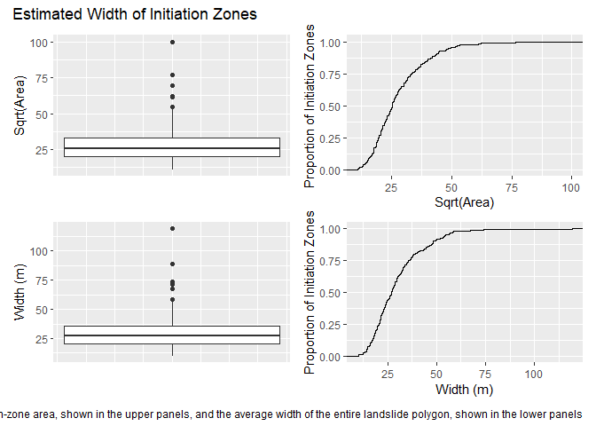
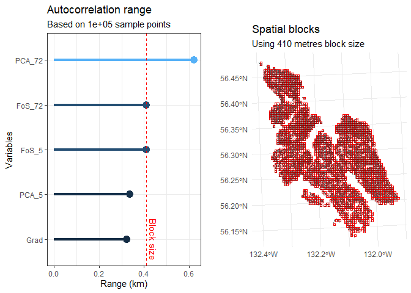

# Modeling_Initiation
Dan
2025-05-29

# Introduction

How can we effectively characterize the potential for landslide
initiation? A landslide inventory shows where landslides have occurred
over some period of time. We use the inventory to identify conditions
spatially and temporally associated with landslide occurrence. We assume
that the landslides in the inventory represent some proportion of the
population of all possible landslides and expect that landslides in the
future will be associated with similar conditions. We can characterize
these associations in terms of density: the number (or area or volume)
of observed landslides per unit basin area. We seek to determine
landslide density as a function of measurable attributes of the terrain
and weather associated with the landslides observed. In most cases, we
focus on the terrain because we do not have reliable methods for
measuring attributes of the weather associated with landslide
occurrence.

Once we have functions describing landslide density in terms of terrain
attributes, we can create maps of landslide density based on those
attributes. If done well, we should find that most of the observed
landslide initiation zones fall within areas of high modeled landslide
density, but perhaps not all the initiation zones, because some
proportion of the landslides may have occurred in unusual locations. A
low modeled density indicates conditions associated with a smaller
proportion of the observed landslides. Likewise, we will have zones of
high modeled landslide density where there are no observed landslides in
our inventory. We expect that the inventory represents only a portion of
the entire population of all possible landslides. Areas of high modeled
density indicate those zones with conditions similar to the conditions
where landslides were observed. We expect that these will be sites of
landslide occurrence in the future.

Within the boundaries of the basin or study-area where the landslide
inventory was collected, if we integrate the modeled density over that
area, the integral will give the number (or area or volume, depending on
how the landslide initiation zones where characterized) of landslides
within that boundary. The number (area, volume) of inventoried
landslides, however, depends on the time period, and the
landslide-triggering storms that occurred during that period, over which
the inventory was collected. So density can only provide a relative
measure of how landslide potential varies over the landscape, showing
where conditions associated with a greater or lesser proportion of the
landslides in the inventory exist.

To provide an absolute measure of landslide potential, we can translate
the density of landslides to the proportion of landslides. Then our maps
go from indicating the number (or area or volume) of landslides in the
inventory associated with particular terrain attributes to the
proportion of landslides in the inventory associated with those
attributes. This provides a testable prediction. For any future
landslide inventory, we can predict what proportion of observed
landslides will occur within any particular portion of a basin or study
area. We can then, for example, delineate those locations from which we
expect a certain proportion (e.g., 20%) of all landslides will occur,
ranked by landslide density.

The goal here is to find functions relating landslide density to terrain
attributes. The frequency-ratio method measures density directly. To
measure the frequency ratio, construct two cumulative frequency
distributions for a single attribute, such as hillslope gradient, one
distribution for areas within the initiation zones and another for the
entire study area. Then divide the distribution for the initiation zones
by the distribution for the entire area. For any increment of hillslope
gradient, this ratio gives the proportion of area in the initiation
zones; that is, the density as a function of gradient. One can
generalize to more than one attribute, but characterizing the frequency
distribution of multiple attributes becomes exceeding uncertain and
sensitive to any peculiarities in our sample of landslides: we encounter
the [curse of
dimensionality](https://en.wikipedia.org/wiki/Curse_of_dimensionality)

Frequency ratio is appealing because it uses all the information we can
infer about topography from a DEM and is easily interpreted. But I would
also like to explore relationships with multiple terrain attributes.
There are many classification modeling strategies available: logistic
regression, random forest, etc., but these require that we extract a
sample of points from both the initiation zones and the rest of the
study area. The attributes associated with those points are then used to
characterize conditions associated with the initiation zones. This
characterization is provided as a probability that any location is
within an initiation zone. Probability in this case can be interpreted
as density. For example, if we randomly sample 100 points from the study
area with a modeled probability of 0.7, we expect that 70 will fall
inside initiation zones and 30 outside. Density is simply a measure of
proportion: 70 points out of 100 gives a density of 0.7. There is
uncertainty in what the measured proportion will be, but we can
calculate that uncertainty as a function of the probability and the
number of points sampled.

The issue now is, how to select the sample of points? How many, and how
should they be divided between the initiation zones and everywhere else?
Given that the initiation zones may cover a fraction of a percent of the
study area, it is not immediately obvious how to divvy up the points. An
assumption inherent in these classification methods is that the value at
any sample point is independent of the value at any other point. Because
these methods are ultimately determining proportions (e.g., what
proportion of sampled points over a gradient interval of 0.7 to 0.8 fell
within initiation zones), if some points are essentially sampling the
same location (e.g., the same landslide scar), the calculated
proportions will be biased towards values at those locations. How do we
ensure that the sampled points provide independent values? Finally, how
do our choices about sample selection affect the modeled probabilities?

# Independence

How far apart do the sample points need to be to ensure that each
provides a measure of terrain attributes independent of the values at
any other point? We can look at the degree of autocorrelation for
topographic attributes using, e.g., a semivariogram, as we do below, but
what does that actually tell us?

Consider a long, planar slope. The elevation changes in a regular
fashion along the fall line, but not at all along a contour. The
gradient (measured along the fall line) is about the same everywhere on
the slope, so the degree of correlation is high. The gradient will
decrease at the ridge crest and the base of the slope, so the range on
the semivariogram should be about the length of the hillslope. Yet, we
may find multiple, separate landslides initiating within lesser
distances of each other on the slope. What terrain attributes might be
affecting landslide initiation? If we exclude the ridge and base of the
slope from calculation of the semivariance, we may find a smaller range
(and sill) indicative of minor variations in gradient along the slope.
Is this the appropriate separation distance to use?

Given our reliance on remotely sensed data, we cannot fully assess the
factors that influence landslide initiation and it is probable that some
of these factors are not visible with the data we have. These
invisible-to-use factors may vary over length scales less than the
variations visible in our remotely sensed data, even with
high-resolution lidar-derived topography. The size distribution of the
landslide scars themselves may offer some insight. Here are boxplots and
cumulative frequency distributions of the estimated width of the
initiation zones of the 244 landslide polygons used from the Tongass
National Forest landslide inventory on Wrangell Island. Width is
estimated both as the square root of the initiation-zone surface area
and from the average width of the entire landslide polygon.

``` r
library(data.table)
library(ggplot2)
library(patchwork)
library(TerrainWorksUtils)
library(stringr)

initStats <- as.data.table(read.csv("c:/work/data/wrangell/outpoly1_init.csv"))

boxarea <- ggplot(initStats, aes(y=sqrt(Area_m2))) + 
  geom_boxplot() +
  labs(y = "Sqrt(Area)") +
  theme(axis.text.x = element_blank(),
        axis.ticks.x = element_blank())

cumarea <- ggplot(initStats, aes(x=sqrt(Area_m2))) + 
  stat_ecdf(geom="step") +
  labs(x = "Sqrt(Area)",
       y = "Proportion of Initiation Zones")

boxwidth <- ggplot(initStats, aes(y=Width_m)) + 
  geom_boxplot() +
  labs(y = "Width (m)") +
  theme(axis.text.x = element_blank(),
        axis.ticks.x = element_blank())

cumwidth <- ggplot(initStats, aes(x=Width_m)) + 
  stat_ecdf(geom="step") +
  labs(x = "Width (m)",
       y = "Proportion of Initiation Zones")

pwidth <- (boxarea + cumarea) / (boxwidth + cumwidth)
pwidth <- pwidth + plot_annotation(
  title = "Estimated Width of Initiation Zones" ,
  caption = "Width (m) is estimated as the square root of the initiation-zone area, shown in the upper panels, and the average width of the entire landslide polygon, shown in the lower panels")
pwidth
```



Both measures suggest that about 90% of all initiation zones are 50 m or
less in width. Let’s look at some potential predictors. Program
samplePoints will read the specified rasters of predictors, find the
range of predictor values that fall within the initiation-zone polygons,
and create a mask file to exclude areas outside those ranges. This is
similar to excluding the ridge top and valley floor with looking at
gradient values in the planar-slope example described above. We are
examining only those areas with the range of predictor values where
landslide initiations were observed. The code chunks below will run
samplePoints to create a mask raster and then use the cv_spatial_autocor
function from the blockCV package to calculate semivariograms for each
predictor raster. The semivariogram will indicate the range of spatial
autocorrelation for each predictor.

``` r
library(terra, exclude = "resample")
```

    terra 1.8.5


    Attaching package: 'terra'

    The following object is masked from 'package:TerrainWorksUtils':

        align

    The following object is masked from 'package:patchwork':

        area

    The following object is masked from 'package:data.table':

        shift

``` r
# List of predictor rasters, single precision real
r1 <- c("Grad", "c:/work/data/wrangell/grad_15", 0.01, 0.99)
r2 <- c("FoS_5", "c:/work/data/wrangell/FoS_pca5", 0., 0.99)
r3 <- c("FoS_72", "c:/work/data/wrangell/FoS_pca72", 0., 0.99)
r4 <- c("PCA_5", "c:/work/data/wrangell/pca_5", 0., 0.99)
r5 <- c("PCA_72", "c:/work/data/wrangell/pca_72", 0., 0.99)
R4rasters <- list(r1,r2,r3,r4,r5)

for (i in 1:length(R4rasters)) {
  r <- terra::rast(paste0(R4rasters[[i]][2],".flt"))
  names(r) <- R4rasters[[i]][1]
  if (i == 1) {
    rstack <- r
  } else {
    rstack <- c(rstack, r)
  }
}
```

``` r
# Run sample points to build a raster masking zones outside the range of predictor values
# associated with landslide initiation zones. Edit input variables as needed
inRaster <- "c:/work/data/wrangell/init" # initiation zones, raster created by LS_poly
areaPerSample <- 250. # within initiation zones, one point every areaPerSample square meters
buffer <- 10. # buffer around sample points, in meters
margin <- 1. # margin around initiation zones to preclude sample points close to the edge, in meters
ratio <- 1. # ratio of sample points outside initiation zones to those within
nbins <- 100 # number of bins for building histograms

# Add landform type
i1 <- c("Landform", "c:/work/data/wrangell/newLandform")
I4rasters <- list(i1)

minPatch <- 100000.
inPoints <- "c:/work/data/wrangell/inpoints1000"
outPoints <- "c:/work/data/wrangell/outpoints"
outMask <- "c:/work/data/wrangell/mask"
outInit <- "c:/work/data/wrangell/initMod"
table <- "c:/work/data/wrangell/table"
scratchDir <- "c:/work/scratch"
executableDir <- "c:/work/sandbox/landslideutilities/projects/samplepoints/x64/release"

returnCode <- TerrainWorksUtils::samplePoints(
  inRaster,
  areaPerSample,
  buffer,
  margin,
  ratio,
  nbins,
  R4rasters,
  I4rasters,
  minPatch,
  inPoints,
  outPoints,
  outMask,
  outInit,
  table,
  scratchDir,
  executableDir)

if (returnCode != 0) {
  stop("Error in samplePoints, return code: ", returnCode)
}

mask <- terra::rast(paste0(outMask, ".flt"))
for (i in 1:length(R4rasters)) {
  rstack[[i]] <- rstack[[i]] * mask
}
```

``` r
library(blockCV)
```

    Warning: package 'blockCV' was built under R version 4.4.3

    blockCV 3.1.5

``` r
library(automap)
```

    Warning: package 'automap' was built under R version 4.4.3

``` r
var <- cv_spatial_autocor(r=rstack, num_sample=100000)
```


      |                                                                            
      |                                                                      |   0%
      |                                                                            
      |==============                                                        |  20%
      |                                                                            
      |============================                                          |  40%
      |                                                                            
      |==========================================                            |  60%
      |                                                                            
      |========================================================              |  80%
      |                                                                            
      |======================================================================| 100%



``` r
var$range_table
```

      layers    range       sill
    1   Grad 321.7127 0.03004510
    4  PCA_5 336.7446 0.01614475
    2  FoS_5 410.2357 0.01838947
    3 FoS_72 411.0471 0.01700197
    5 PCA_72 621.6264 1.72465911

Gradient was calculated over a diameter of 15 meters, thus smoothing
variations over length scales less than that. The range of the
semivariogram for this measure of gradient is about 300 meters, which is
around the midpoint of hillslope lengths included within the mask
raster. The two flow accumulation rasters, PCA_5 and PCA_72, indicate
the approximate contributing area for each DEM cell for a 5 and 72 hour
storm, assuming a saturated hydraulic conductivity of 1 m/sec and
ignoring infiltration time. PCA_5 is highly correlated with gradient and
has a similar semivariogram range. PCA_72 has flow concentrations within
channels and exhibits much larger variability than PCA_5, indicated by
its larger range and sill. The factor of safety values (FoS) are derived
from the gradient and flow accumulation values. Despite the large
differences between PCA_5 and PCA_72, the FoS rasters based on these
exhibit similar patterns of variability with nearly equal ranges and
sills.

What do these range values imply for our strategy of sampling
independent points? They are all several times larger than the typical
scale of a landslide initiation zone. Even if we use the ~300-m range
found for gradient as the minimum point spacing, that precludes more
than one sample point per landslide initiation zone. Ultimately the goal
is to have a representative sample that accurately reflects the range
and frequency distribution of predictor values across both the observed
initiation zones and the masked area spanning the range of values
observed within the initiation zones. Independence precludes bias in our
representation of those frequency distributions, but bias will still be
an issue if we have too few points.

# Number

How many randomly placed sample points do we need to obtain an accurate
and complete representation of the frequency distribution of predictor
values? That depends on how uniform the frequency distributions are.
Long-tailed distributions require more points to ensure that rare
conditions get samples. We can compare frequency distributions of
sample-point sets to those of the predictor rasters. This is straight
forward for single predictors, but becomes more complicated when looking
at combinations of predictors.

Representative sample, curse of dimensionality.

## Single predictors

Let’s start with one sample point per initiation zone and a point
spacing of 300m elsewhere. We can generate point samples with program
samplePoints.

``` r
# Edit input variables as needed
inRaster <- "c:/work/data/wrangell/init" # initiation zones, raster created by LS_poly
areaPerSample <- 282743. # within initiation zones, one point every areaPerSample square meters
buffer <- 300. # buffer around sample points, in meters
margin <- 1. # margin around initiation zones to preclude sample points close to the edge, in meters
ratio <- 3. # ratio of sample points outside initiation zones to those within
nbins <- 100 # number of bins for building histograms

# Add landform type
i1 <- c("Landform", "c:/work/data/wrangell/newLandform")
I4rasters <- list(i1)

minPatch <- 100000.
inPoints <- "c:/work/data/wrangell/inpoints_1"
outPoints <- "c:/work/data/wrangell/outpoints_1"
outMask <- "c:/work/data/wrangell/mask"
outInit <- "c:/work/data/wrangell/initMod"
table <- "c:/work/data/wrangell/table"
scratchDir <- "c:/work/scratch"
executableDir <- "c:/work/sandbox/landslideutilities/projects/samplepoints/x64/release"

returnCode <- TerrainWorksUtils::samplePoints(
  inRaster,
  areaPerSample,
  buffer,
  margin,
  ratio,
  nbins,
  R4rasters,
  I4rasters,
  minPatch,
  inPoints,
  outPoints,
  outMask,
  outInit,
  table,
  scratchDir,
  executableDir)
```

I found building cumulative distributions with R to be rather slow, so
program samplePoints also outputs a csv file with a histogram for each
of the predictors. We can use these to compare the frequency
distributions of the sample points to those of the predictor rasters.
The files have five columns:

1.  Lower, the lower bound of the interval

2.  Upper, the upper bound of the interval

3.  Mid, the midpoint of the interval

4.  Number, the number of DEM cells or sample points included in the
    interval

5.  CumulativeProp, the cumulative proportion of cells or samples

There are two things of interest:

1.  How different, or similar, are the frequency distributions for areas
    inside and outside of the initiation zones?

2.  How well do the frequency distributions for the sample points match
    those of the area sampled?

``` r
pcum_in <- vector(mode = "list", length = length(R4rasters))
pcum_out <- vector(mode = "list", length = length(R4rasters))
pdif <- vector(mode = "list", length = length(R4rasters))
pbar <- vector(mode = "list", length = length(R4rasters))
pbar_in <- vector(mode = "list", length = length(R4rasters))
pbar_out <- vector(mode = "list", length = length(R4rasters))

for (i in 1:length(R4rasters)) {
  name <- R4rasters[[i]][[1]]
  d_in<- as.data.table(read.csv(paste0(table, 
                                       "_", 
                                       name, 
                                       "_in.csv")))
  
  d_sampleIn <- as.data.table(read.csv(paste0(table, 
                                              "_", 
                                              name, 
                                              "_inSample.csv")))
  
  d_out <- as.data.table(read.csv(paste0(table, 
                                         "_", 
                                         name, 
                                         "_out.csv")))
  
  d_sampleOut <- as.data.table(read.csv(paste0(table,
                                               "_",
                                               name,
                                               "_outSample.csv")))
 
  sum_in <- d_in[, sum(Number)]
  sum_out <- d_out[, sum(Number)]
  sum_sampleIn <- d_sampleIn[, sum(Number)]
  sum_sampleOut <- d_sampleOut[, sum(Number)]
  pbar[[i]] <- ggplot() +
    geom_bar(data=d_in, 
             aes(x = Mid, y = Number/sum_in, fill = "Inside"), 
             stat = "identity",
             alpha = 0.6) +
    geom_bar(data=d_out,
             aes(x = Mid, y = Number/sum_out, fill = "Outside"),
             stat = "identity",
             alpha = 0.6) +
    labs(title = "Comparison of areas inside and outside of initiation zones",
         x = name,
         y = "Proportion") +
    theme(legend.title = element_blank(),
          legend.position = "inside",
          legend.position.inside = c(0.9, 0.8)) 
  
  
  pdif[[i]] <- ggplot() +
    geom_line(data=d_in, 
              aes(x=Upper, y = CumulativeProp, color = "Inside"),
              linewidth = 1.2) +
    geom_line(data=d_out,
              aes(x = Upper, y = CumulativeProp, color = "Outside"),
              linewidth = 1.2) +
    labs(title = "Comparison of areas inside and outside of initiation zones",
         x = name,
         y = "Cumulative Proportion") +
    theme(legend.title = element_blank(),
          legend.position = "inside",
          legend.position.inside = c(0.85, 0.2))
  
  
  pbar_in[[i]] <- ggplot() +
    geom_bar(data=d_sampleIn, 
             aes(x=Mid, y=Number/sum_sampleIn, fill="Sample Points"), 
             stat="identity", 
             alpha=0.6) +
    geom_bar(data=d_in, 
             aes(x=Mid, y=Number/sum_in, fill="Total Area"), 
             stat="identity", 
             alpha=0.3) +
    labs(title = "Inside Initiation Zones",
         x = name,
         y = "Proportion") +
    theme(legend.title = element_blank(),
          legend.position = "inside",
          legend.position.inside = c(0.9, 0.8))
  
  pbar_out[[i]] <- ggplot() +
    geom_bar(data=d_sampleOut, 
             aes(x=Mid, y=Number/sum_sampleOut, fill="Sample Points"), 
             stat="identity", 
             alpha=0.6) +
    geom_bar(data=d_out, 
             aes(x=Mid, y=Number/sum_out, fill="Total Area"), 
             stat="identity", 
             alpha=0.6) +
    labs(title = "Outside Initiation Zones",
         x = name,
         y = "Proportion") +
    theme(legend.title = element_blank(),
          legend.position = "inside",
          legend.position.inside = c(0.9, 0.8))
  
  pcum_in[[i]] <- ggplot() + 
    geom_line(data = d_in, 
              aes(x = Upper, y = CumulativeProp, color = "Total Area"),
              linewidth = 1.2) +
    geom_line(data=d_sampleIn, 
              aes(x=Upper, y=CumulativeProp, color="Sample Points"), 
              linewidth=1.2) +
    labs(title = "Inside Initiation Zones",
         x = name,
         y = "Cumulative Proportion") +
    theme(legend.title = element_blank(),
          legend.position = "inside",
          legend.position.inside = c(0.8,0.2))
  
  pcum_out[[i]] <- ggplot() +
    geom_line(data=d_out, 
              aes(x=Upper, y=CumulativeProp, color="Total Area"), 
              linewidth=1.2) +
    geom_line(data=d_sampleOut, 
              aes(x=Upper, y=CumulativeProp, color="Sample Points"), 
              linewidth=1.2) +
    labs(title = "Outside Initiation Zones",
         x = name,
         y = "Cumulative Proportion") +
    theme(legend.title = element_blank(),
          legend.position = "inside",
          legend.position.inside = c(0.8, 0.2))
}
```

``` r
for (i in 1:length(R4rasters)) {
  pbar[[i]] / pdif[[i]]
}
for (i in 1:length(R4rasters)) {
  pbar_in[[i]] / pcum_in[[i]]
}
for (i in 1:length(R4rasters)) {
  pbar_out[[i]] / pcum_out[[i]]
}
```

\#`{r} # Create a mask of initiation zones #init <- terra::rast(paste0(outInit, ".flt")) #for (i in 1:length(R4rasters)) { #  if (i == 1) { #    pstack <- rstack[[1]] * init #  } else { #    pstack <- c(pstack, rstack[[i]] * init) #  } #} #`

\#`{r} #gradinit <- as.data.table(pstack[[1]]) #na.omit(gradinit) # get rid of all those nodata rows #gradall <- as.data.table(rstack[[1]]) #na.omit(gradall) #`

\#`{r} #p_grad <- ggplot() +  #  geom_density(data=gradinit, aes(x=Grad, fill = 'Inside'), alpha=0.5) +   #  geom_density(data=gradall, aes(x=Grad, fill = 'Outside'), alpha=0.5) + #  scale_fill_manual(name = "", values = c(Outside = 'blue', Inside = 'red')) + #  labs( #    x = "Gradient", #    y = "Density") + #  theme(legend.position = "inside", legend.position.inside = c(0.6, 0.8)) #`

\#`{r} #sampleInit <- as.data.table(read.csv(paste0(table, "_long.csv"))) #sampleInit <- sampleInit[, Variable := str_trim(Variable)] #sampleInit <- sampleInit[, Class := str_trim(Class)] #grad <- sampleInit[Variable == "Grad",] #s_grad <- ggplot() + #  geom_density(data=grad, aes(x=Value, fill = Class), alpha = 0.5) + #  scale_fill_manual(name = "",values=c("red","blue")) + #  labs( #    x = "Gradient", #    y = "Density") + #  theme(legend.position = "inside", legend.position.inside = c(0.6, 0.8)) #`

\#`{r} #p_inside <- ggplot() + #  stat_ecdf(data=gradinit, aes(x=Grad, color="Total Area"), geom="step", linewidth=1.2) + #  stat_ecdf(data=grad[Class=="Inside"], aes(x=Value, color="Sample"), geom="step", linewidth=1.2) #p_outside <- ggplot() + #  stat_ecdf(data=gradall, aes(x=Grad, color="Total Area"), geom="step", linewidth=1.2) + #  stat_ecdf(data=grad[Class=="Outside"], aes(x=Value, color="Sample"), geom="step", linewidth=1.2) #p_ecdf <- p_inside + p_outside #p_ecdf #`

\#\`\`\`{r} \#library(mlr3) \#library(mlr3viz) \#library(mlr3learners)
\#library(mlr3filters) \#library(ranger) \#library(xgboost)

\#data_wide \<- as.data.table(read.csv(paste0(table, “\_wide.csv”)))
\#data_long \<- as.data.table(read.csv(paste0(table, “\_long.csv”)))
\#data_wide \<- data_wide\[, Class := str_trim(Class)\] \#data_wide \<-
data_wide\[, Class := as.factor(Class)\] \#data_wide \<- data_wide\[,
Landform := as.factor(Landform)\] \#data_wide \<- data_wide\[, Record :=
NULL\] \#\`\`\`

\#\`\`\`{r} \#library(mlr3spatial) \#library(mlr3spatiotempcv)

\#for (i in 1:length(I4rasters)) { \# r \<-
terra::rast(paste0(I4rasters\[\[i\]\]\[2\],“.flt”)) \# names(r) \<-
I4rasters\[\[i\]\]\[1\] \# cls \<- data.frame(id=1:7,
Landform=levels(data_wide\$Landform)) \# levels(r) \<- cls \# rstack \<-
c(rstack, r) \#}

\#library(sf)

\#coordSys \<- crs(rstack) \#data_sf \<- sf::st_as_sf(data_wide, coords
= c(“x”,“y”), crs=coordSys) \#tsk_init \<- as_task_classif_st(data_sf,
target = “Class”, positive = “Inside”) \#tsk_init \#levs \<-
levels(tsk_init$truth())
#pfmlr = function(model, ...) {
# if(model$predict_type == “prob”) { \# p =
model$predict_newdata(...)$data$prob
#   if(length(levs) != ncol(p)) {
#     missing = setdiff(levs, colnames(p))
#     pm = matrix(0, ncol = length(missing), nrow = nrow(p), dimnames = list(NULL, missing))
#     p = cbind(p, pm)
#     p = p[, levs]
#   }
# } else {
#   model$predict_newdata(…)$data$response \# } \#}

\#lrn_ranger \<- lrn(“classif.ranger”, predict_type = “prob”)
\#lrn_ranger\$train(tsk_init)

\#prob2 \<- predict(rstack, lrn_ranger, fun = pfmlr, na.rm = TRUE)
\#predprob \<- predict_spatial(rstack, lrn_ranger, format = “terra”,
chunksize = 1000L) \`\`\`
