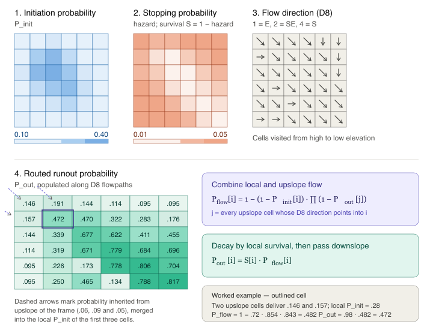

```{r}
source("./functions.R")

mitkof <- readRDS(
  "/Users/Jeff/Dropbox/Documents/TealWaters/Data/Tongass/mitkof_rasters/mitkof_state.rds")
wrangell <- readRDS(
  "/Users/Jeff/Dropbox/Documents/TealWaters/Data/Tongass/wrangell_rasters/wrangell_state.rds")

mitkof   <- load_rstack(mitkof)
wrangell <- load_rstack(wrangell)
```

# Routing landslide runout

In this notebook, we map out the probability of each pixel being along the centerline of a landslide runout pathway. To do this, we propogate and accumulate landslide initiation probabilities downslope using a flow-routing algorithm, while assessing the probabilities of landslides stopping at each pixel. To do this, we have two modeling tasks:

1.  Modeling the probability of landslides *stopping* at any pixel based on local topographic conditions (and potentially individual flow properties).
2.  Combining initiation probabilities and stopping probabilities to model the probability of runout along paths of steepest descent.

## Modeling landslide stopping

Landslides will slide, collapse, and/or flow downslope some distance before stopping. Some landslides may fluidize into debris flows, leading to longer runout paths. Physics-based models of fluidization and runout extent require detailed information about the material properties, the degree of saturation, and the size and shape of the initial failure. Because this dataset of landslide polygons was mapped from air photos, none of this information is available within our runout observations. Instead, we use the landslide polygons to train a statistical model that predicts landslide stopping based on topographic metrics. With these limitations in our training data, we essentially treat all landslides as equal when modeling runout and stopping probabilities, and rely only on the topography of the runout path.

To train statistical models, we rely on the landslide node dataset that we derived from each landslide polygon. Landslide nodes follow the landslide centerlines and are spaced roughly every 2 m, consistent with the DEM resolution. The final downslope node for each landslide polygon is labeled as the stopping node (`event = 1`). All other nodes are labeled as traversed (`event = 0`). Each node also contains information about local topographic properties (gradient, curvature, and cumulative drainage area), as well as runout path (cumulative distance traversed, cumulative drop in elevation, and gradient at initiation).

We test a few statistical models to relate landslide stopping to topographic and runout properties. We try both logistic regression modeling and survival analysis.

## Plotting survival curves and runout profiles

First, we assess the distribution of runout lengths for each island. These distributions could be used to estimate baseline stopping probabilities as a function of distance traveled. Generally, the slides on Mitkof and Wrangell runout several hundred meters before stopping. Both islands have a handful of slides that runout more than a kilometer.

Below, we find that landslide runout distance follows an exponential decay, indicating that the probability of stopping does not depend on distance traveled and is, on average, 0.0029/m for Mitkof and 0.0039/m for Wrangell. This suggests that keeping track of distance traveled will likely not improve our ability to predict where landslides stop. However, stopping probability likely does depend on other factors, and we will test the impact of topographic predictors for modeling landslide stopping.

```{r fig.width=12, fig.height=5}
par(mfrow = c(1, 2))

lambda_mitkof   <- plot_survival(mitkof)
lambda_wrangell <- plot_survival(wrangell)
```

## Modeling when landslides stop

Here, we'll test whether we can do a better job at modeling stopping probability than the constant values measured above by considering local topographic conditions along the runout paths.

### Examining covariates

First, we compare the distributions of topographic metrics between those nodes that are transited by landslides versus those nodes where landslides stopped.

**Gradient** - Perhaps unsurprisingly, gradient does the best job of differentiating transited nodes from stopping nodes, with landslides stopping once they reach lower-gradient terrain.

**Upstream area** - The upstream accumulation area of stopping nodes is more tightly distributed than the transited nodes (most clearly seen in the log-transformed values), but the modal values are similar.

**Curvature** - The distributions of curvature values are similar between transited and stopping nodes, although it appears that landslides tend *not* to stop at nodes with larger values of tangential curvature. This makes intuitive sense, since tangential curvature measures lateral confinement of flow and more confined flows concentrate the tractive forces that sustain and grow landslides as the flow downslope.

**Landscape position** - The final two covariates relate stopping to the vertical position of landslide runout in the landscape. We were curious whether landslides that had experienced a greater vertical drop might have more momentum and be less likely to stop. This, however, was not the case, likely because greater vertical drops also correspond with lower, gentler terrain. For this same reason, the elevations of stopping nodes tend to be lower than the elevations of transited nodes.

In the modeling to follow, we evaluate several combinations of parameters but find that log gradient, elevation, tangential curvature, and log accumulation area is the best combination of predictors.

```{r fig.width=10, fig.height=12}
#| fig-cap: "Density distributions of topographic predictors for landslide
#|   (red) and background (blue) points. Distributions are shown separately
#|   for Wrangell and Mitkof."

predictors <- c("UpArea_m2","logaccum", "gradient","log_grad","tangential_curv", "Prof","dem","drop")
mains <- c("upstream area (m^2)","log10(upstream area)", "gradient","log10(gradient)","tangential curvature (m^-1)", "profile curvature (m^-1)","elevation (m)","cumulative vertical drop (m)")

wrangell$nodes_df$dataset <- "Wrangell"
mitkof$nodes_df$dataset   <- "Mitkof"
df_all <- rbind(wrangell$nodes_df, mitkof$nodes_df)
df_all$label <- factor(df_all$event, labels = c("Transitting", "Stopping"))

plots <- lapply(seq_along(predictors), function(i) {
  ggplot(df_all, aes(x = .data[[predictors[i]]], fill = label)) +
    geom_density(alpha = 0.5) +
    facet_wrap(~ dataset) +
    labs(title = mains[i], x = NULL, y = NULL, fill = NULL) +
    theme_minimal(base_size = 16) +
    theme(legend.position = "bottom",
          plot.title = element_text(size = 16, face = "bold"))
})
wrap_plots(plots, ncol = 2) +
  plot_layout(guides = "collect") &
  theme(legend.position = "bottom")
```

### Logistic regression stopping model

A simple approach to include topographic covariates in the estimation of runout distances is to use logistic regression modeling. In this approach, stopping probabilities are modeled based on local topographic covariates. Each node receives a unique and independent stopping probability, regardless of where the landslide initiated and the path it took to get there. Runout distances for individual landslides can therefore be estimated probabilistically by compounding the probabilities that a landslide passes each successive node. For the purposes of generating runout probability maps we'll continue tracking runout paths until the edge of the domain. For the purposes of assessing this model, we can track runout probabilities along mapped node paths and evaluate the estimated runout probabilities at the actual stopping node.

### Survival stopping model

In previous landslide studies (\[links\]), TerrainWorks has modeled landslide runout using survival analysis, a field of statistics with the goal of modeling the timing of events (e.g., mechanical failures or death) given variable conditions/attributes during the period of survival. For landslide runout, we substitute time for space and evaluate the distance traveled given variable topographic conditions along the runout path.

Survival analysis has one major advantage over logistic regression: it includes a flexible baseline that captures how stopping probability varies with distance traveled. This keeps distance from confounding the local covariate coefficients. For example, in a logistic model with no distance term, the stopping effect attributed to low gradient may partly reflect that those stopping nodes sit systematically far along the path. Recall we concluded earlier that distance alone is a poor predictor of stopping probability. However, it's possible that landslides have lower stopping probabilities at longer runout distances and those lower stopping probabilities are canceled out by the lower gradients further along the runout path. Survival analysis accounts for those mixed effects.

The disadvantage of survival analysis is that it depends on runout distance, so pixels have different values depending on where a passing landslide initiated. For the training dataset, we know where landslides initiated and the paths they took to reach every node. To model the susceptibility to future landslide runout, we do not know exactly where landslides will initiate. Consequently, we would need to model landslide initiation from each upstream pixel separately, severely complicating model implementation.

Below, we compare the performance of both models for predicting runout paths in the training dataset, by propagating stopping probabilities along the flow paths. For both islands, the logistic regression model gives cleaner prediction results, with tighter distributions of the final stopping probability at the actual stopping node. It's not clear that adding the distance term in the cox survival analysis adds a benefit.

### Testing stopping models

#### Mitkof

\[\***Check how these multiple figures render on website**\*\]

Below, two figures, each with several panels, show the runout predictions using both models. Landslides are placed into 4 groups, a stopping model is trained on 3 groups and then used to predict the stopping probabilities for the remaining group, and it is those testing data that are reported below.

In an ideal case, the distribution of final runout probabilities (right histogram) should show a cluster of landslide stopping probabilities around 0.5 (or really any value that can later be calibrated). The logistic regression histogram does have a central tendency of runout probabilities around 0.6. The survival analysis has a flatter distribution of final runout probabilities. This indicates that the Cox model's runout probability is not a reliable predictor of where landslides actually stop.

The Cox survival model does have one meaningful advantage. The logistic regression model struggles to predict anomalously long runout landslides. For every landslide that runs out longer than 1.5 km, the logistic regression model predicts that there's less than a 10% chance that the landslide reaches its final node. Those longer runout landslides are better predicted by the Cox model.

Given that the logisitic regression model is simpler and has better overall performance, we will use the logistic regression model for runout predictions on Mitkof. However, the model does struggle to predict the anomalously long landslide runouts and that should be noted.

```{r fig.width=12, fig.height=5}
form <- glm(event ~ log_grad + tangential_curv + logaccum+dem,
                   data = mitkof$nodes_df,
                   family = binomial)
runout_hazard_cv(form, mitkof, k = 4, seed = 1)
form <- Surv(tstart, tstop, event) ~ log_grad + tangential_curv + logaccum+dem
runout_hazard_cv(form, mitkof, k = 4, seed = 1)
```

#### Wrangell

Results for Wrangell are similar to Mitkof: Cox modeling struggles to predict runout distance overall, but it has an edge at predicting long runout pathways. As with Mitkof, we will use the simpler logistic regression model for island-wide predictions.

```{r fig.width=12, fig.height=5}
form <- glm(event ~ log_grad + tangential_curv + logaccum+dem,
                   data = mitkof$nodes_df,
                   family = binomial)
runout_hazard_cv(form, wrangell, k = 4, seed = 1)
form <- Surv(tstart, tstop, event) ~ log_grad + tangential_curv + logaccum+dem
runout_hazard_cv(form, wrangell, k = 4, seed = 1)

```

### Other tests

We experimented with several other model configurations, in addition to what is presented above, but none of those adjustments improved model performance. We added predictors, changed predictors, and experimented with a spline-based Cox model. A spline survival model has the advantage that it can better capture complicated, even non-monotonic, relationships between predictors and stopping probabilities. This could be useful for capturing, for example, the peak in stopping probabilities for moderate values of accumulation area. However, the spline-based model did not improve our predictions.

We also experimented with including some non-local topographic predictors. In reality, the upslope conditions may play an important role in determining the size and velocity of a landslide, and therefore its likelihood of stopping soon. In some models, we experimented with tracking the conditions (gradient and curvature) of upslope nodes. In theory, tracking rolling upslope averages of gradient and curvature could help determine if a landslide has been gaining or losing momentum. We also tried to include the gradient of the landslide initiation zone, which might help determine the initial size of the slide. All of these additional non-local topographic parameters resulted in only marginal improvements to model performance but added complicated path-dependence for predicting future landslide behavior. Consequently, we chose to exclude those parameters.

The final model formulas are defined below.

```{r}
mitkof$stop_fit <- glm(event ~ log_grad + tangential_curv + logaccum+dem,
                 data = mitkof$nodes_df,
                 family = binomial,
                 model = TRUE)

wrangell$stop_fit <- glm(event ~ log_grad + tangential_curv + logaccum+dem,
                 data = wrangell$nodes_df,
                 family = binomial,
                 model = TRUE)

save_island(mitkof)
save_island(wrangell)
```

# Runout predictions

In order to predict runout we need to propagate stopping probabilities downslope. We did this already for predicting runout along known runout pathways. Predicting runout for future landslides, where most pixels have some finite probability of being a landslide initiation site, is a bit more complicated. We need to integrate initiation probabilities and runout probabilities along predicted descent paths. Landslide runout paths do not necessarily follow paths of steepest descent because the momentum of landslides can cause them to continue straight at bends in the steepest descent path. However, we have no ability to predict size or velocity of these slides/flows and we have no alternative other than following steepest descent paths.

Along steepest descent paths, we can calculate the probability that a pixel passes a landslide to its downslope neighbor. The probability of a pixel containing a landslide is equal to the combined probabilities of receiving a landslide from (one of) its upslope neighbor(s), and the probability of a landslide initiating locally. Mathematically the probability of containing a landslide is:\
$$P_{flow}[i] = (1-(1-P_{init}[i])\cdot \prod(1-P_{out}[j])$$

where j is any upslope cell that flows into cell *i*. The probability of that flow getting passed to the downslope pixel is:

$$
P_{out}[i]=S[i]\cdot P_{flow}[i]
$$

where *S* is the survival probability (equal to one minus the stopping probability). Here's a sample schematic to describe the calculation:

{fig-align="center" width="607"}

## Runout probabilities for test slices

To map runout probabilties for test slices, we need the three input rasters listed above: initiation probability, stopping probability, and flow direction. We have the two statistical models needed to calculate the initiation probability and stopping probability from this quarto notebook and the previous notebook. Below, we implement those models and combine them using the runout scheme described above. These provide a sample of what the combined model produces for our test slices and what will be implemented at full scale for both islands.

### Mitkof

```{r fig.width = 10, fig.height = 15}

mitkof$test_stack$ls_prob <- rast(mitkof$test_stack$mask)
mitkof$test_stack$ls_prob[mitkof$test_df$ind] <- as.vector(predi(mitkof$init_fit,mitkof$test_df))

plot_runout_test(mitkof,min_show = 0.001)
```

### Wrangell

```{r fig.width = 10, fig.height = 15}
wrangell$test_stack$ls_prob <- rast(wrangell$test_stack$mask)
wrangell$test_stack$ls_prob[wrangell$test_df$ind] <- as.vector(predi(wrangell$init_fit,wrangell$test_df))

plot_runout_test(wrangell,min_show = 0.001)
```
